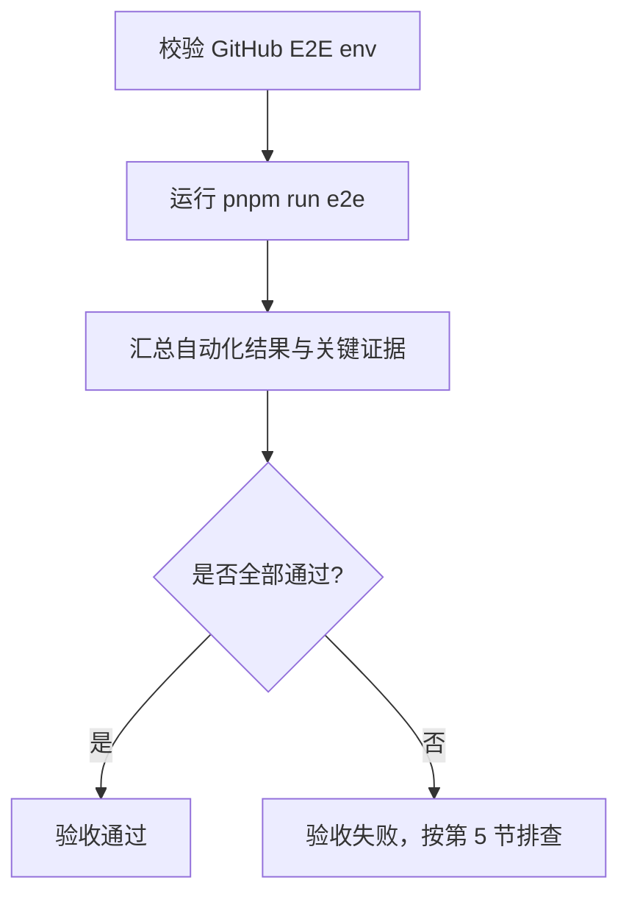
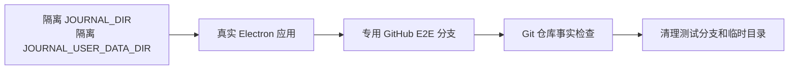
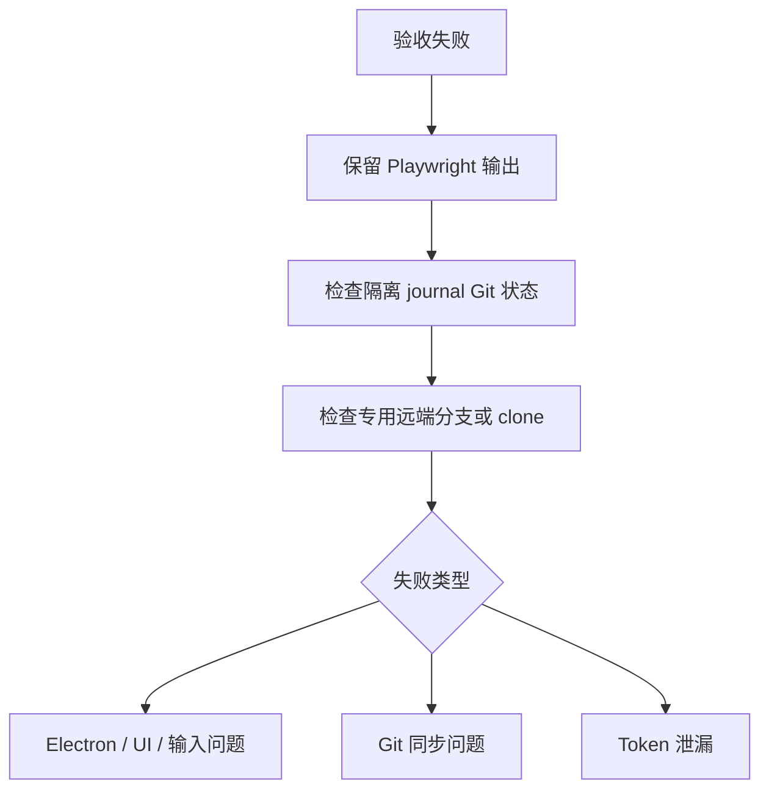

# Electron 桌面端验收 SOP

这份 SOP 用于桌面端 Electron 应用验收。标准验收只使用隔离数据目录和专用 GitHub E2E 仓库。

## 1. 前置条件

从 monorepo 根目录执行，并配置专用 GitHub E2E 仓库：

```sh
export JOURNAL_E2E_GITHUB_REMOTE_URL=https://github.com/<owner>/<e2e-private-repo>.git
export JOURNAL_E2E_GITHUB_TOKEN=<fine-grained-token>
```

可选：

```sh
export JOURNAL_E2E_GITHUB_BRANCH_PREFIX=e2e/playwright
```

桌面 Playwright 默认就是 `e2e/playwright`，通常不用设置。也可以写入根目录 `.env.e2e.local`。shell env 优先，缺少必填 env 时不要继续验收。

## 2. 标准流程



标准命令：

```sh
: "${JOURNAL_E2E_GITHUB_REMOTE_URL:?missing JOURNAL_E2E_GITHUB_REMOTE_URL}"
: "${JOURNAL_E2E_GITHUB_TOKEN:?missing JOURNAL_E2E_GITHUB_TOKEN}"
pnpm run e2e
```

最终结论只认这条完整流程；拆分运行只用于定位。

## 3. 流程保证



约束：

- 设置 `JOURNAL_DISABLE_WEATHER=1`。
- 不读取或写入真实 `~/.journal`。
- 不使用真实日记远端。
- 失败输出不能包含 GitHub token。

## 4. 通过标准

通过标准：

- 命令退出码为 0。
- 同步相关断言没有被跳过。
- 本地隔离 journal 没有同步范围内的未提交改动。
- 本地 Git 仓库没有游离 `HEAD` 或短 ref 残留。
- 专用远端分支与本轮写入结果一致。
- 远端 clone 后仓库状态干净。

同步范围只检查：

```txt
entries/
media/
annotations/
reviews/
manifest.json
```

## 5. 失败处理



失败时保留 Playwright 输出、失败截图或 trace、E2E 分支名，以及本地/远端 Git 事实。

失败判定：

| 信号 | 结论 |
| --- | --- |
| 缺少 `JOURNAL_E2E_GITHUB_REMOTE_URL` 或 `JOURNAL_E2E_GITHUB_TOKEN` | 测试环境错误，命令必须失败 |
| `HEAD` 没有附着在 `refs/heads/<branch>` | 同步失败 |
| `.git/main` 存在 | 同步失败 |
| 同步范围内有未提交改动 | 同步失败 |
| 本地显示已同步但远端 clone 没有内容 | 同步失败 |
| 连续输入产生多个不必要提交 | 同步节奏失败 |
| 最新提交没有用户内容，只包含系统元数据 | 同步失败 |
| 输出中出现 token | 立即清理输出，不继续传播 |

## 6. 视觉确认

视觉确认只在布局、窗口尺寸或交互密度改动时补充执行。

检查项：

- Electron 窗口真实打开，不是浏览器预览。
- 主界面、编辑区、导航和同步状态没有遮挡、重叠或空白。
- 常见内容长度和弹层状态下布局仍稳定。
- 窗口尺寸约束符合桌面端设计要求。

手动打开窗口时仍使用隔离目录和同一套 GitHub E2E env。

## 7. 维护规则

- SOP 的验收入口只有完整流程：env preflight + `pnpm run e2e`。
- 拆分运行只能用于失败定位，不能单独作为最终验收结论。
- 测试实现细节留在 E2E 代码中，不写进 SOP 主流程。
- 更新 E2E 脚本时同步更新本 SOP。
