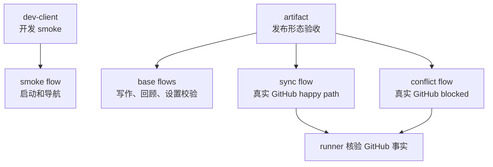
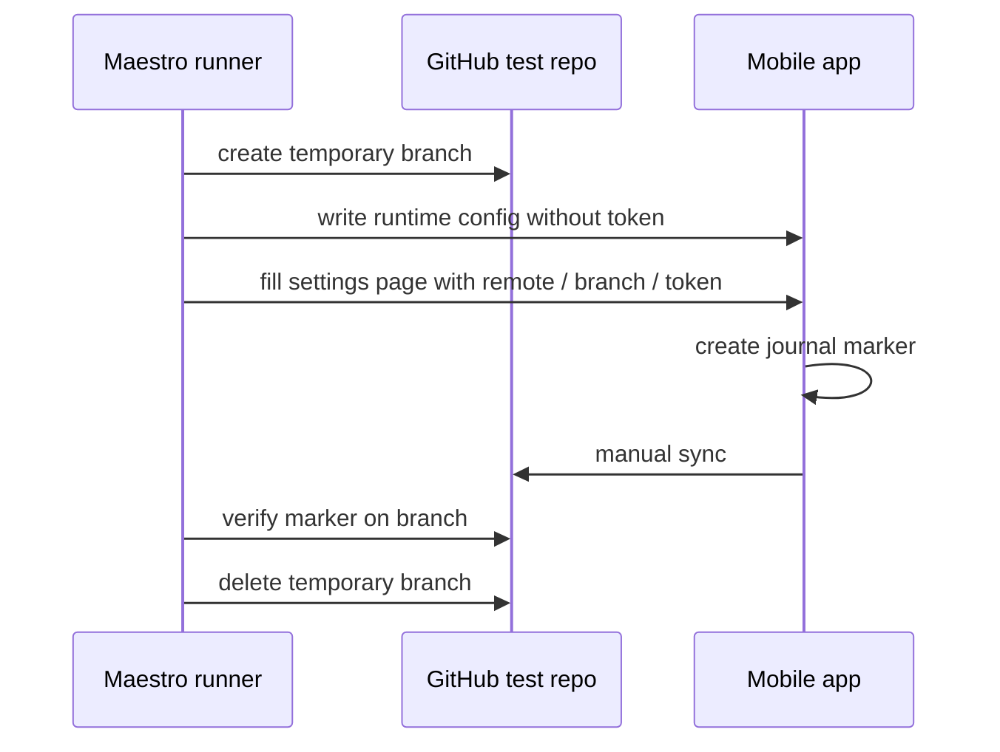
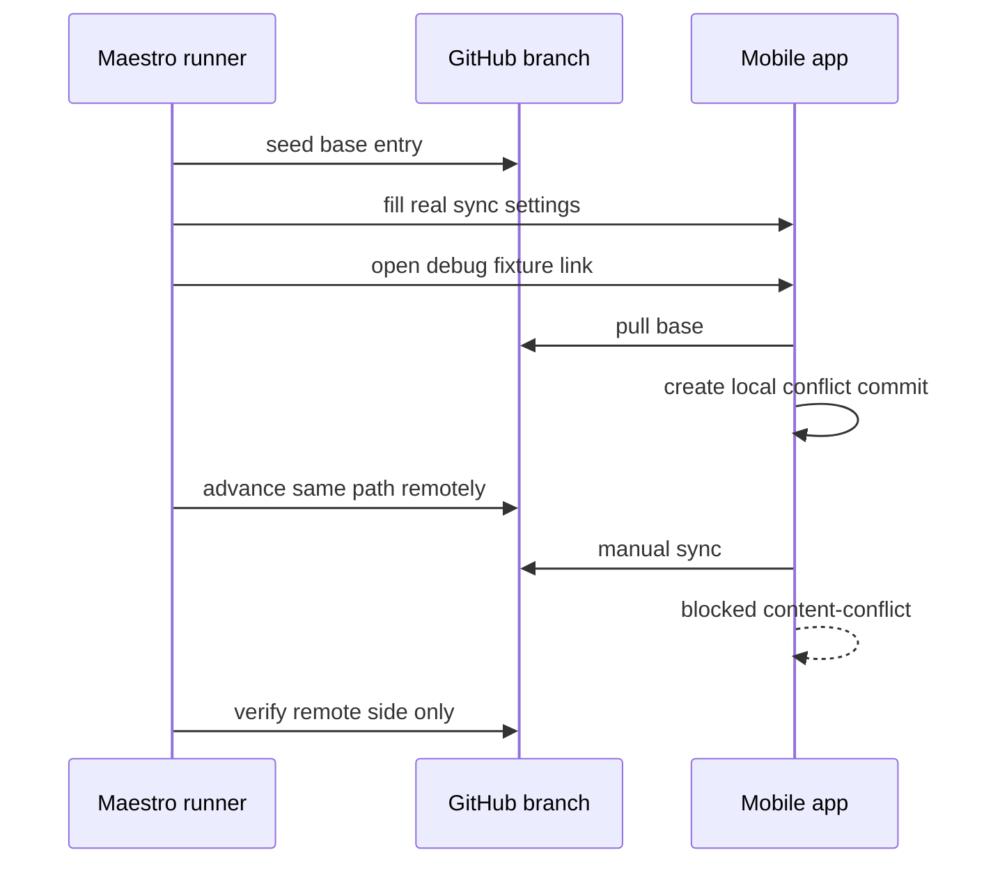
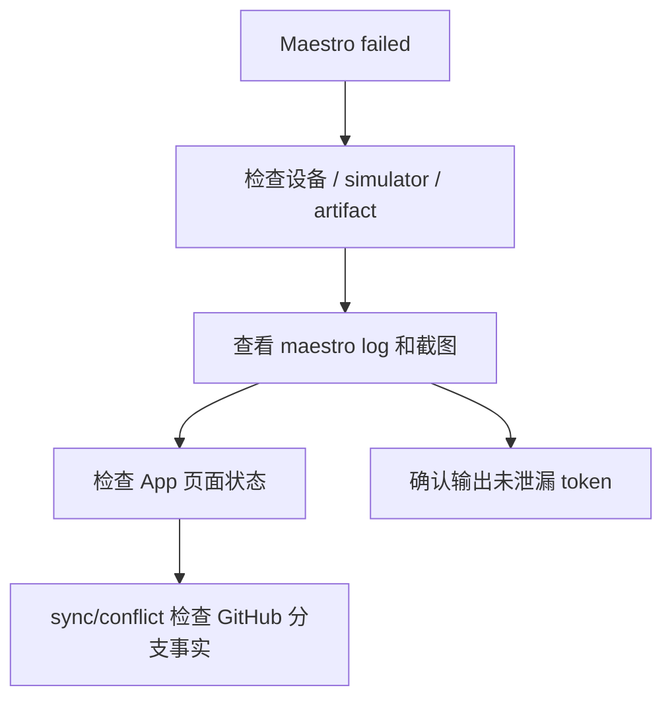

# Mobile Maestro 验收 SOP

这份 SOP 用于移动端原生 E2E 验收。它覆盖 artifact、真实 GitHub sync 和真实 `content-conflict` blocked；Dev Client 只作为开发 smoke。

## 1. 前置条件

从 monorepo 根目录执行。

基础依赖：

- Maestro CLI 和 Java 17+ 在 `PATH`，或设置 `MAESTRO_CLI` / `JAVA_HOME`。
- iOS：启动一个 iOS Simulator；必要时设置 `JOURNAL_MOBILE_E2E_DEVICE_ID=<simulator-udid>`。
- Android：连接并授权设备，必须设置 `JOURNAL_MOBILE_E2E_DEVICE_ID=<device-serial>`。
- artifact：iOS 传 `.app`，Android 传 APK。

真实 GitHub sync / conflict 还需要根目录 `.env.e2e.local` 或 shell env：

```sh
JOURNAL_E2E_GITHUB_REMOTE_URL=https://github.com/<owner>/<repo>.git
JOURNAL_E2E_GITHUB_TOKEN=<fine-grained-token>
JOURNAL_E2E_GITHUB_BRANCH_PREFIX=<branch-prefix> # optional
```

必须使用专用私有测试仓库，不使用真实日记仓库。

## 2. 运行模式



| 模式 | 命令 | 定位 |
| --- | --- | --- |
| iOS artifact | `pnpm run e2e:mobile:ios:artifact` | iOS 发布形态基础验收 |
| Android artifact | `pnpm run e2e:mobile:android:artifact` | Android 发布形态基础验收 |
| iOS sync | `pnpm run e2e:mobile:ios:sync` | iOS 真实 GitHub 同步 |
| Android sync | `pnpm run e2e:mobile:android:sync` | Android 真实 GitHub 同步 |
| iOS conflict | `pnpm run e2e:mobile:ios:sync-conflict` | iOS 真实 GitHub 冲突阻断 |
| Android conflict | `pnpm run e2e:mobile:android:sync-conflict` | Android 真实 GitHub 冲突阻断 |
| Dev Client | `pnpm run e2e:mobile:ios:dev` / `:android:dev` | 本地开发联调，不作为发布验收 |

## 3. Artifact 验收

iOS：

```sh
JOURNAL_MOBILE_E2E_IOS_APP_PATH=apps/mobile/build/ios/Build/Products/Release-iphonesimulator/app.app \
pnpm run e2e:mobile:ios:artifact
```

Android：

```sh
pnpm --filter @journal/mobile run build:android:apk
JOURNAL_MOBILE_E2E_DEVICE_ID=<device-serial> \
pnpm run e2e:mobile:android:artifact
```

默认 artifact flow：

- `long-entry-flow.yaml`
- `today-writing-flow.yaml`
- `murmur-edit-flow.yaml`
- iOS: `review-back-loop-ios-flow.yaml`
- Android: `review-back-loop-flow.yaml`
- `settings-sync-validation.yaml`

通过标准：

- 命令退出码为 0。
- App 能冷启动到 Today。
- 长文、碎碎念、回顾和设置校验都完成。
- 失败日志不包含真实 GitHub token。

## 4. 真实 Sync



命令：

```sh
pnpm run e2e:mobile:ios:sync
pnpm run e2e:mobile:android:sync
```

通过标准：

- App UI 显示同步完成。
- runner clone / read 远端临时分支，确认有本轮 marker。
- 临时分支被清理。
- 失败时不能把含 token 的 Maestro commands JSON 原样传播。

## 5. 真实 Conflict



命令：

```sh
pnpm run e2e:mobile:ios:sync-conflict
pnpm run e2e:mobile:android:sync-conflict
```

通过标准：

- App 显示 `content-conflict` blocked 卡片。
- 卡片有冲突路径、本机 preview、远端 preview。
- 展示 `keep-local`、`keep-both`、`keep-remote` 三个入口。
- runner 验证远端只包含 remote side，不包含本机失败侧和 conflict markers。

这条 flow 证明真实冲突会 block。它还不证明用户点选边后的恢复。

## 6. Runtime Config

artifact 下 runner 会在需要 sync 或 debug fixture 时，把非 secret 配置写入 App sandbox：

```txt
journal-mobile-e2e-config.json
```

该文件只包含：

- `runId`
- `debugFixturesEnabled`
- `version`

GitHub token 不写入 runtime config，也不写入 `EXPO_PUBLIC_*`。token 只由 Maestro 输入真实设置页。

## 7. 常用变量

| 变量 | 用途 |
| --- | --- |
| `JOURNAL_MOBILE_E2E_DEVICE_ID` | Android 必填；iOS 可指定 simulator |
| `JOURNAL_MOBILE_E2E_IOS_APP_PATH` | iOS `.app` 路径 |
| `JOURNAL_MOBILE_E2E_ANDROID_APK_PATH` | Android APK 路径 |
| `JOURNAL_MOBILE_E2E_ARTIFACT_PATH` | 通用 artifact 路径覆盖 |
| `JOURNAL_MOBILE_E2E_APP_ID` | 覆盖 bundle id / package name |
| `JOURNAL_MOBILE_E2E_RUN_ID` | 可选稳定 run id |
| `JOURNAL_MOBILE_E2E_SKIP_INSTALL=1` | 跳过 artifact 安装 |
| `JOURNAL_MOBILE_E2E_ENABLE_DEBUG_FIXTURES=1` | 默认 flow 中额外跑 UI-only blocked fixture |
| `JOURNAL_E2E_GITHUB_REMOTE_URL` | 专用 GitHub E2E 仓库 |
| `JOURNAL_E2E_GITHUB_TOKEN` | 专用 token |
| `JOURNAL_E2E_GITHUB_BRANCH_PREFIX` | 临时分支前缀 |

## 8. 失败处理



常见失败判定：

| 信号 | 处理 |
| --- | --- |
| 找不到 simulator / device | 先启动设备或设置 `JOURNAL_MOBILE_E2E_DEVICE_ID` |
| 找不到 artifact | 重新构建或设置 artifact path |
| GitHub env 缺失 | 环境错误，不能当作通过 |
| sync UI 成功但远端没有 marker | 同步失败 |
| conflict 没有 blocked 卡片 | 冲突阻断失败 |
| commands JSON 或日志含 token | 立即清理输出，不继续传播 |

## 9. 维护规则

- 新增 Maestro flow 时同步更新 [测试用例清单](<测试用例清单.md>)。
- 真实 sync flow 必须核验 GitHub 远端事实，不能只看 UI 文案。
- `sync-now-flow.yaml` 和 `sync-conflict-flow.yaml` 分开跑，各自使用独立临时分支。
- debug fixture 只证明 UI，不作为真实 Git 语义证据。
