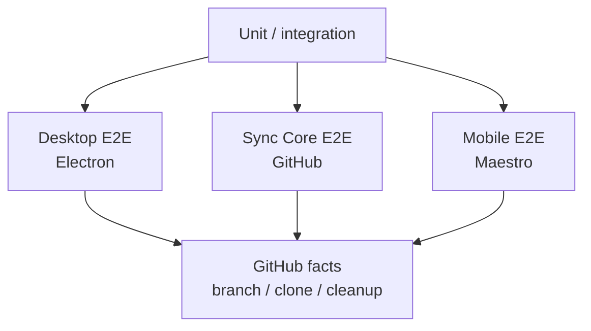
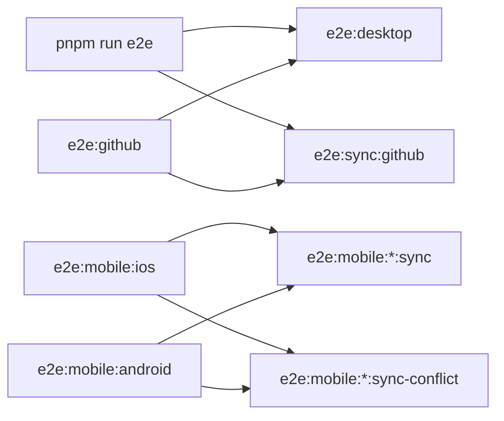

# E2E 测试

本目录是 E2E 的统一入口。README 只放入口、命令和环境约定；具体用例和平台 SOP 放到独立文档。

## 文档目录

- [测试用例清单](<测试用例清单.md>)：Playwright specs 和 Maestro flows 分别证明什么。
- [覆盖与设计](<覆盖与设计.md>)：覆盖矩阵、缺口和后续路线图。
- [Electron 桌面端验收 SOP](<Electron 桌面端验收 SOP.md>)：桌面端标准验收与失败处理。
- [Mobile Maestro 验收 SOP](<Mobile Maestro 验收 SOP.md>)：移动端 artifact、sync 和 conflict 验收流程。

## 分层



`pnpm test` 跑 unit + integration。E2E 只用于真实应用、真实 GitHub、真实设备或模拟器这些跨系统路径。

## 命令入口



| 命令 | 用途 | 依赖 |
| --- | --- | --- |
| `pnpm run e2e` / `e2e:required` | 默认门禁：桌面全套 + sync core GitHub | GitHub E2E env |
| `pnpm run e2e:desktop` | 桌面本地 + 桌面 GitHub sync | GitHub E2E env |
| `pnpm run e2e:desktop:local` | 桌面本地快速回归 | 无外网 |
| `pnpm run e2e:desktop:sync` | 桌面真实 GitHub sync | GitHub E2E env |
| `pnpm run e2e:github` | 所有真实 GitHub E2E | GitHub E2E env |
| `pnpm run e2e:sync:github` | `@journal/sync` 真实 GitHub E2E | GitHub E2E env |
| `pnpm run e2e:mobile:ios` / `:android` | mobile artifact Maestro | `.app` / APK + 设备 |
| `pnpm run e2e:mobile:ios:sync` / `:android:sync` | mobile 真实 GitHub 同步 | mobile artifact + GitHub E2E env |
| `pnpm run e2e:mobile:ios:sync-conflict` / `:android:sync-conflict` | mobile 真实 GitHub 冲突阻断 | mobile artifact + GitHub E2E env |
| `pnpm run e2e:mobile:ios:dev` / `:android:dev` | Dev Client smoke | 已安装 dev client |

`pnpm run e2e` 不包含 mobile Maestro。移动端必须显式选 iOS 或 Android，不再推断平台。

## GitHub Env

GitHub E2E 只认这三个变量：

```sh
JOURNAL_E2E_GITHUB_REMOTE_URL=https://github.com/<owner>/<repo>.git
JOURNAL_E2E_GITHUB_TOKEN=<fine-grained-token>
JOURNAL_E2E_GITHUB_BRANCH_PREFIX=<branch-prefix> # optional
```

Playwright 和 mobile Maestro runner 都会先读取根目录 `.env.e2e.local`，只填充当前 shell 缺失的变量。CI 或 shell 中已有变量优先。

不设置分支前缀时，Playwright / sync core 使用 `e2e/playwright`，mobile runner 使用 `mobile-e2e`。设置 `JOURNAL_E2E_GITHUB_BRANCH_PREFIX` 会覆盖两边的临时分支前缀。

必须使用专用私有测试仓库，不使用真实日记仓库。缺少 remote URL 或 token 是环境错误，测试应失败，不允许 skip 当通过。

Token 不写入 `EXPO_PUBLIC_*`。mobile runner 读取 token 后，只通过 Maestro 填入真实设置页。

## 脚本速查

```sh
pnpm test
pnpm run e2e
pnpm run e2e:desktop:local
pnpm run e2e:desktop:sync
pnpm run e2e:sync:github
pnpm run e2e:mobile:ios:artifact
pnpm run e2e:mobile:ios:sync
pnpm run e2e:mobile:ios:sync-conflict
pnpm run e2e:mobile:android:artifact
pnpm run e2e:mobile:android:sync
pnpm run e2e:mobile:android:sync-conflict
```
