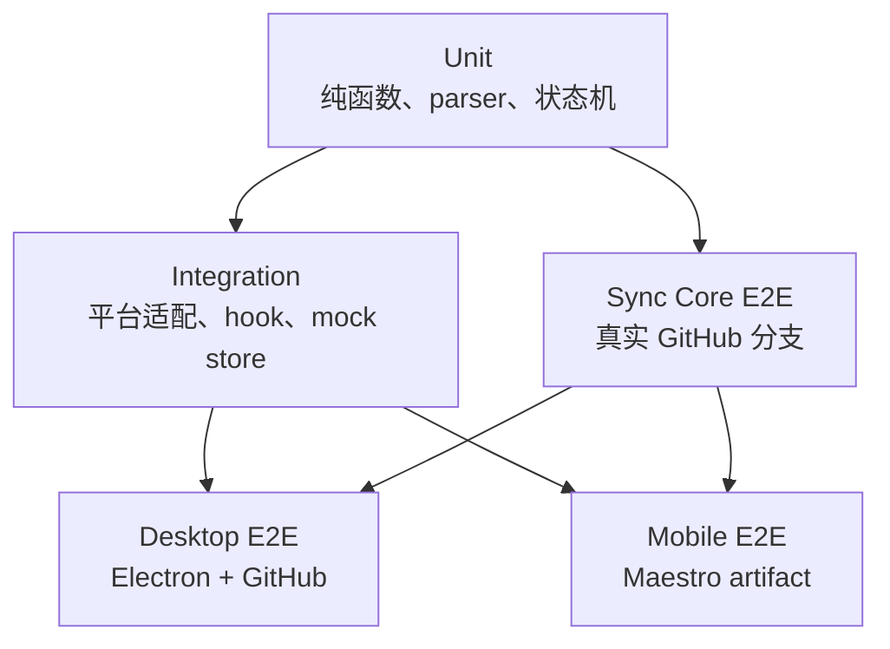
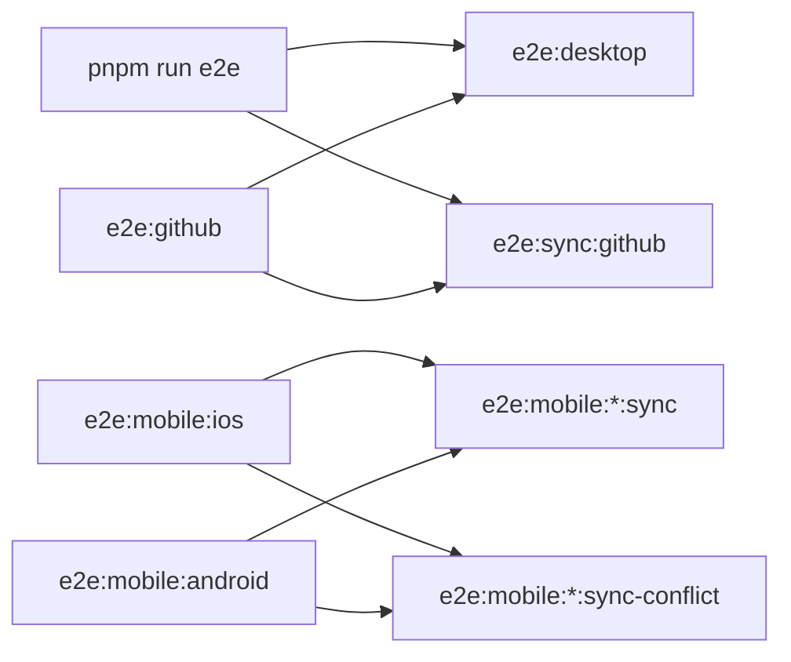
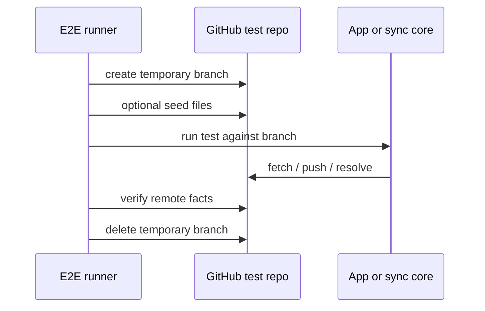
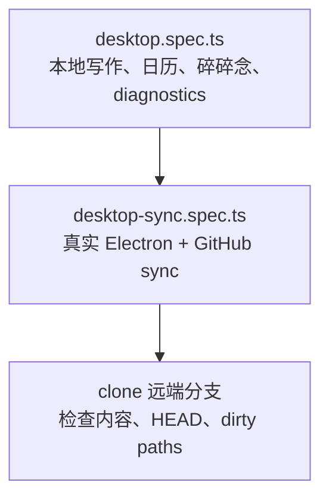
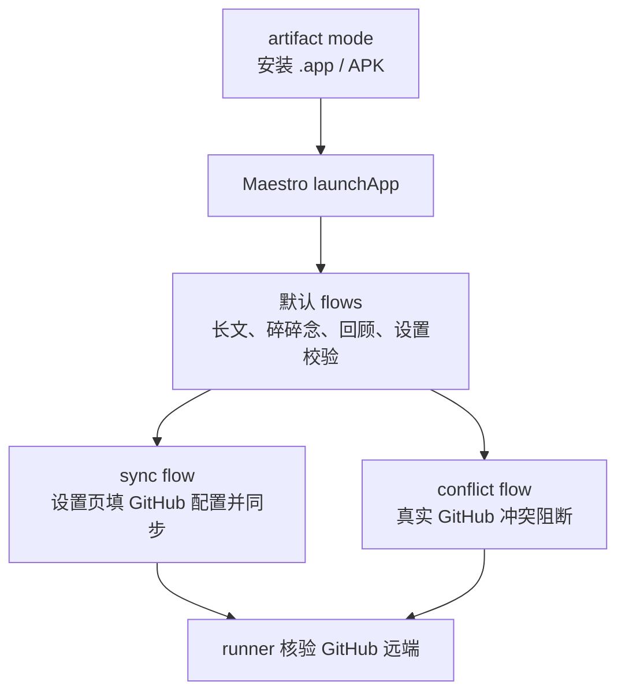
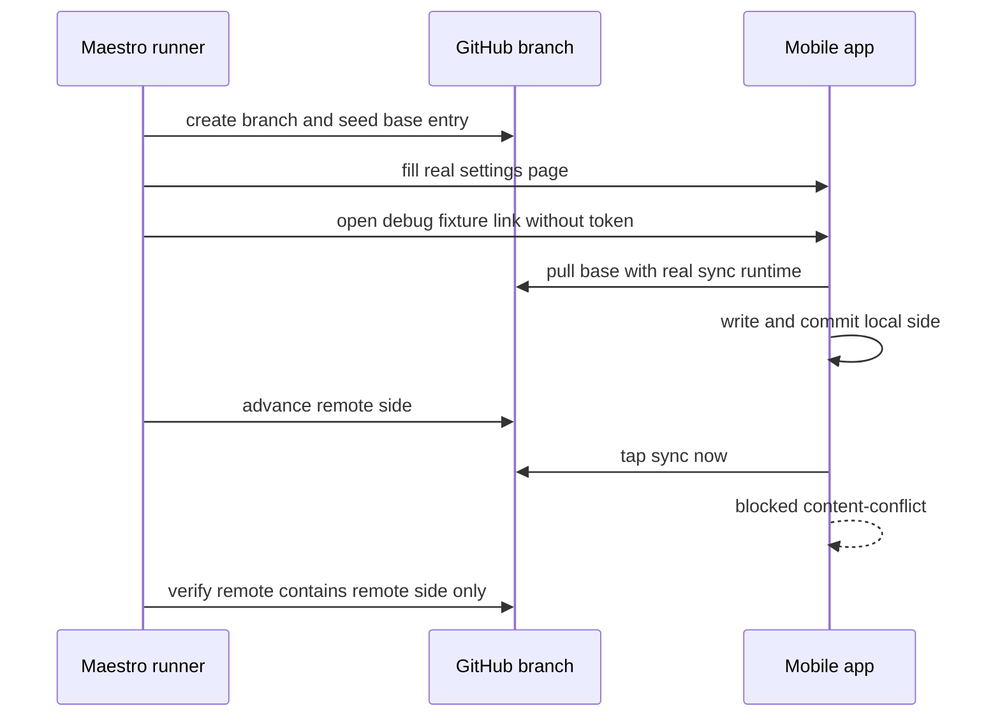

# E2E 测试

本目录是 E2E 的统一入口。这里放可执行手册和覆盖设计，产品文档只保留入口链接。

## 文档目录

- 本文：日常运行入口、环境变量和当前覆盖摘要。
- [覆盖与设计](<覆盖与设计.md>)：覆盖矩阵、缺口和后续路线图。
- [Electron 桌面端验收 SOP](<Electron 桌面端验收 SOP.md>)：桌面端标准验收与失败处理。

## 分层



`pnpm test` 跑 unit + integration。E2E 只用于真实应用、真实 GitHub、真实设备或模拟器这些跨系统路径。

## 命令入口



| 命令 | 用途 | 依赖 |
| --- | --- | --- |
| `pnpm run e2e` / `e2e:required` | 默认门禁：桌面全套 + sync core GitHub | GitHub E2E env |
| `pnpm run e2e:desktop` | 桌面本地 + 桌面 GitHub sync | GitHub E2E env |
| `pnpm run e2e:desktop:local` | 桌面本地快速回归 | 无外网 |
| `pnpm run e2e:github` | 所有真实 GitHub E2E | GitHub E2E env |
| `pnpm run e2e:sync:github` | `@journal/sync` 真实 GitHub E2E | GitHub E2E env |
| `pnpm run e2e:mobile:ios` / `:android` | mobile artifact Maestro | `.app` / APK + 设备 |
| `pnpm run e2e:mobile:ios:sync` / `:android:sync` | mobile 真实 GitHub 同步 | mobile artifact + GitHub E2E env |
| `pnpm run e2e:mobile:ios:sync-conflict` / `:android:sync-conflict` | mobile 真实 GitHub 冲突阻断 | mobile artifact + GitHub E2E env |
| `pnpm run e2e:mobile:ios:dev` / `:android:dev` | Dev Client smoke | 已安装 dev client |

`pnpm run e2e` 不包含 mobile Maestro。移动端必须显式选 iOS 或 Android，不再推断平台。

## GitHub Env

GitHub E2E 只认这三个变量：

```sh
JOURNAL_E2E_GITHUB_REMOTE_URL=https://github.com/<owner>/<repo>.git
JOURNAL_E2E_GITHUB_TOKEN=<fine-grained-token>
JOURNAL_E2E_GITHUB_BRANCH_PREFIX=<branch-prefix> # optional
```

Playwright 和 mobile Maestro runner 都会先读取根目录 `.env.e2e.local`，只填充当前 shell 缺失的变量。CI 或 shell 中已有变量优先。

不设置分支前缀时，Playwright / sync core 使用 `e2e/playwright`，mobile runner 使用 `mobile-e2e`。设置 `JOURNAL_E2E_GITHUB_BRANCH_PREFIX` 会覆盖两边的临时分支前缀。

必须使用专用私有测试仓库，不使用真实日记仓库。缺少 remote URL 或 token 是环境错误，测试应失败，不允许 skip 当通过。

Token 不写入 `EXPO_PUBLIC_*`。mobile runner 读取 token 后，只通过 Maestro 填入真实设置页。

## GitHub 分支生命周期



远端事实至少要证明：内容存在、blocked 时远端未污染、没有 conflict markers。桌面和 sync core 还会检查 `HEAD`、dirty paths 和短 ref。

## Desktop E2E



- `e2e:desktop:local` 只跑本地 Electron 回归，不访问 GitHub。
- `e2e:desktop` 会同时跑 GitHub sync，是桌面完整 E2E。
- 桌面 sync 为避免 token 进入截图/trace，通过 preload API 保存真实 token，不走可见 UI。

更严格的桌面验收看 [Electron 桌面端验收 SOP](<Electron 桌面端验收 SOP.md>)。

## Sync Core GitHub E2E

`e2e/github-sync.spec.ts` 覆盖：

- push + clone happy path。
- clean branch 幂等。
- 非冲突双 worktree merge。
- 真实 `content-conflict` blocked，远端不被污染。
- blocked 后 `keep-local` 手动解决。
- `keep-local` / `keep-both` / `keep-remote` 三种恢复策略。

## Mobile E2E



稳定路径：

```sh
JOURNAL_MOBILE_E2E_IOS_APP_PATH=apps/mobile/build/ios/Build/Products/Release-iphonesimulator/app.app \
pnpm run e2e:mobile:ios:artifact

pnpm --filter @journal/mobile run build:android:apk
JOURNAL_MOBILE_E2E_DEVICE_ID=<device-serial> \
pnpm run e2e:mobile:android:artifact
```

真实同步：

```sh
pnpm run e2e:mobile:ios:sync
pnpm run e2e:mobile:android:sync
pnpm run e2e:mobile:ios:sync-conflict
pnpm run e2e:mobile:android:sync-conflict
```

常用 mobile 变量：

| 变量 | 用途 |
| --- | --- |
| `JOURNAL_MOBILE_E2E_PLATFORM=ios|android` | 平台，通常由脚本设置 |
| `JOURNAL_MOBILE_E2E_DEVICE_ID` | Android 必填；iOS 可用于指定 simulator |
| `JOURNAL_MOBILE_E2E_IOS_APP_PATH` / `JOURNAL_MOBILE_E2E_ANDROID_APK_PATH` | artifact 路径 |
| `JOURNAL_MOBILE_E2E_RUN_ID` | 可选；不填时 runner 自动生成，用于 artifact runtime config 和测试分支 |
| `JOURNAL_MOBILE_E2E_ENABLE_DEBUG_FIXTURES=1` | 启用 UI-only debug fixture |

真实 GitHub sync flow 由命令选择：`:sync` 跑 `sync-now-flow.yaml`，`:sync-conflict` 跑 `sync-conflict-flow.yaml`。缺少 `JOURNAL_E2E_GITHUB_REMOTE_URL` 或 `JOURNAL_E2E_GITHUB_TOKEN` 时直接失败。

artifact 包不再需要为了 E2E run id 重新构建。runner 会在需要 sync/debug fixture 的 artifact flow 启动前，把非 secret runtime config 写入 App sandbox：`journal-mobile-e2e-config.json`。这个文件只包含 run id 和 debug fixture gate，不包含 GitHub token；token 仍由 Maestro 通过真实设置页填写。Dev Client 继续由 runner 启动 Metro 时注入 `EXPO_PUBLIC_JOURNAL_MOBILE_E2E_RUN_ID`。

## Mobile 冲突 Flow



`sync-blocked-flow.yaml` 只预览 UI，不证明 Git 语义。正式冲突验收使用 `sync-conflict-flow.yaml`。

## 脚本速查

```sh
pnpm test
pnpm run e2e
pnpm run e2e:desktop:local
pnpm run e2e:desktop:sync
pnpm run e2e:sync:github
pnpm run e2e:mobile:ios:artifact
pnpm run e2e:mobile:ios:sync
pnpm run e2e:mobile:ios:sync-conflict
pnpm run e2e:mobile:android:artifact
pnpm run e2e:mobile:android:sync
pnpm run e2e:mobile:android:sync-conflict
```
