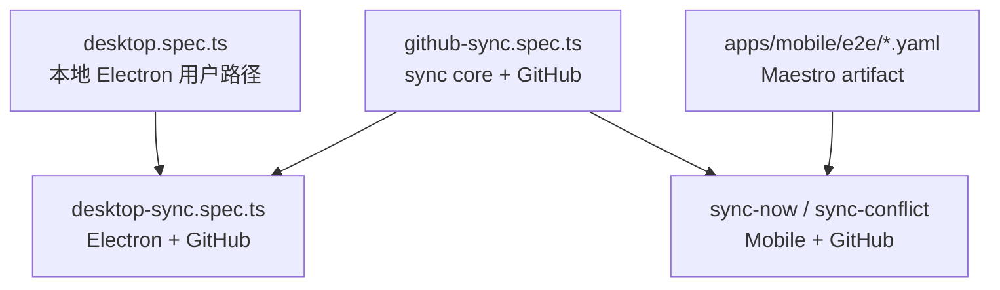
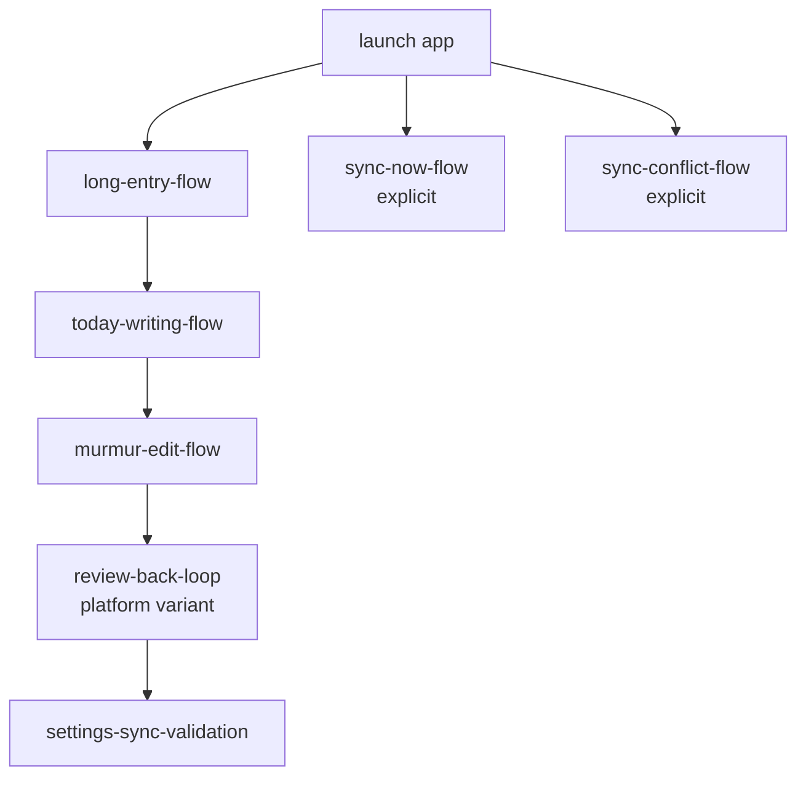

# E2E 测试用例清单

这份清单回答“现在每条 E2E 到底测了什么”。运行方式和环境变量见 [E2E 测试](./README.md)，覆盖缺口和路线图见 [覆盖与设计](<覆盖与设计.md>)。

## 总览

| 层 | 入口 | 主要证明 |
| --- | --- | --- |
| Desktop local | `pnpm run e2e:desktop:local` | 真实 Electron 中写作、碎碎念、日历、diagnostics 可用 |
| Desktop GitHub | `pnpm run e2e:desktop:sync` | 桌面应用能通过真实 GitHub 分支同步内容 |
| Sync core GitHub | `pnpm run e2e:sync:github` | `@journal/sync` 的真实 clone/push/merge/conflict/resolve 语义 |
| Mobile artifact | `pnpm run e2e:mobile:ios` / `:android` | 原生包冷启动和核心 UI 路径 |
| Mobile GitHub | `pnpm run e2e:mobile:ios:sync` / `pnpm run e2e:mobile:android:sync`，以及对应 `:sync-conflict` | 原生 App 真实同步和真实冲突阻断 |

## Desktop Playwright

文件：`e2e/desktop.spec.ts`

| 用例 | 做了什么 | 证明 | 不证明 |
| --- | --- | --- | --- |
| `desktop creates, saves, and reloads today journal content` | 今日页输入正文，等落盘，reload 后检查内容 | CodeMirror 输入、自动保存、Markdown 读取 | GitHub 同步 |
| `desktop creates, persists, and displays a murmur` | 新增碎碎念，检查 Markdown block，reload 后打开编辑态 | 碎碎念创建、序列化、展示 | 多端同步 |
| `desktop opens murmur images in a large preview` | 预置 media 和 murmur image，打开大图预览 | 本地媒体协议、图片预览弹层 | 远端媒体同步 |
| `desktop deletes a murmur and persists the removal` | 删除预置 murmur，reload 后确认消失 | 删除保存、正文保留 | Git delete/push |
| `desktop calendar opens historical entries and saves edits for a selected date` | 日历打开历史日期，编辑后切换日期 | 日历统计、历史日记切换保存 | 跨设备日期冲突 |
| `desktop settings reports unconfigured Git sync state and validates unsafe remotes` | 设置页查看未配置状态，保存带 token remote 失败 | 同步设置 UI、危险 remote 校验 | 真实认证 |
| `desktop surfaces markdown diagnostics for malformed journal files` | 预置坏 front matter，启动后看 diagnostics | 坏 Markdown 可见化 | 自动修复 |

文件：`e2e/desktop-sync.spec.ts`

| 用例 | 做了什么 | 证明 | 不证明 |
| --- | --- | --- | --- |
| `desktop app saves sync settings and syncs a journal entry through GitHub` | 创建 GitHub 临时分支，启动隔离 Electron，保存 sync 配置，真实编辑并点立即同步，再 clone 远端校验 | 桌面 renderer/preload/main 到 `@journal/sync` 的真实 happy path | 桌面冲突 UI、用户手填 token 的完整表单路径 |

## Sync Core GitHub

文件：`e2e/github-sync.spec.ts`

| 用例 | 做了什么 | 证明 | 不证明 |
| --- | --- | --- | --- |
| `github sync core pushes and clones an isolated e2e branch` | 临时分支上写本地内容、sync、clone 验证 | 真实 GitHub push/clone 基础链路 | App UI |
| `github sync core skips a clean branch that already matches the remote` | 本地和远端一致时再次 sync | clean 状态幂等，不制造多余提交 | 性能极限 |
| `github sync core merges non-conflicting local and remote changes` | 两份 worktree 改不同内容后同步 | 非冲突合并和普通 push | 同段冲突 |
| `github sync core blocks true content conflicts without polluting the remote` | 两份 worktree 改同段，后同步者遇到 push rejected 后 fetch/merge | `content-conflict` 会 block，远端不含 conflict markers | UI 选边 |
| `github sync core blocks then resolves a content conflict after a manual keep-local choice` | 先制造 blocked，再执行 keep-local | blocked 后手动策略能继续完成 | App 按钮 |
| `github sync core resolves a true content conflict by keeping local content` | 执行 `keep-local` | 结果 tree 等于本地，正常 push | force push |
| `github sync core resolves a true content conflict by keeping both sides` | 执行 `keep-both` | 两边内容都进入结果 | 逐段人工编辑 |
| `github sync core resolves a true content conflict by keeping remote content without pushing` | 执行 `keep-remote` | 本地对齐 remote tracking，不 push | 保留本地草稿 |

## Mobile Maestro

默认 artifact flow 由 `apps/mobile/scripts/runMaestroE2e.mjs` 选择。iOS 默认使用 `review-back-loop-ios-flow.yaml`，Android 默认使用 `review-back-loop-flow.yaml`。

| Flow | 类型 | 做了什么 | 证明 | 不证明 |
| --- | --- | --- | --- | --- |
| `_launch-app.yaml` | helper | `clearState: true` 冷启动并等待 Today | 普通 flow 有干净状态 | 数据保留 |
| `_launch-app-preserve-state.yaml` | helper | 启动但不清状态 | sync flow 能保留 runtime config 和已填设置 | 冷启动隔离 |
| `_launch-dev-client.yaml` | helper | 等待 Dev Client 已进入 Today | Dev Client smoke 起点 | artifact |
| `_set-home-mode-long-entry.yaml` | helper | 进入设置，把首页模式切到长文 | 长文 flow 有稳定起点 | 设置持久化本身 |
| `_set-home-mode-murmur.yaml` | helper | 进入设置，把首页模式切到碎碎念 | 碎碎念 flow 有稳定起点 | 设置持久化本身 |
| `long-entry-flow.yaml` | artifact default | 切到长文首页，输入长文并从列表打开 | 长文输入、保存、列表打开 | GitHub sync |
| `today-writing-flow.yaml` | artifact default | 切到碎碎念首页，新增碎碎念，进列表和回顾再返回 | Today、碎碎念、日记列表、Review 入口 | 长文模式 |
| `murmur-edit-flow.yaml` | artifact default | 新增碎碎念，再编辑为新文本 | 碎碎念编辑和保存 | 删除 |
| `review-back-loop-flow.yaml` | Android default | 多次进入 Review，用按钮和系统 Back 返回 | Android Back 和导航栈 | iOS swipe |
| `review-back-loop-ios-flow.yaml` | iOS default | 多次进入 Review，用按钮和右滑返回 | iOS 手势返回和导航栈 | Android Back |
| `settings-sync-validation.yaml` | artifact default | 设置页输入危险 remote 和假 token，保存失败 | 同步配置入口、安全校验 | 真实认证 |
| `sync-blocked-flow.yaml` | optional debug | 打开 debug blocked 链接，检查 blocked 卡片、路径、preview 和三个按钮 | blocked UI 展示 | 真实 Git 冲突 |
| `sync-now-flow.yaml` | explicit sync | 设置页填真实 GitHub 配置，写入 marker，手动同步，runner 验证远端 | mobile 真实 GitHub happy path | 冲突恢复 |
| `sync-conflict-fixture-flow.yaml` | conflict helper | 填配置，打开 debug fixture 让 App pull base 并制造 local commit | 为真实冲突准备稳定本地侧 | 最终断言 |
| `sync-conflict-flow.yaml` | explicit conflict | 点同步后进入 `content-conflict`，检查路径、两侧 preview 和三个按钮 | 原生 App 真实遇到 GitHub 冲突会 block | 点选边后的恢复 |
| `dev-client-smoke-flow.yaml` | dev-client | Dev Client 下进入设置再返回 Today | 开发包和导航基本可用 | 发布 artifact |

## 当前未覆盖

- Desktop App 层真实 conflict blocked 和选边恢复。
- Mobile App 层点击 `keep-local` / `keep-both` / `keep-remote` 后的真实恢复。
- GitHub E2E 文件类型矩阵：delete、media、reviews、annotations、manifest。
- 双端并发、自动调度、弱网、大仓库和长期重复同步。
