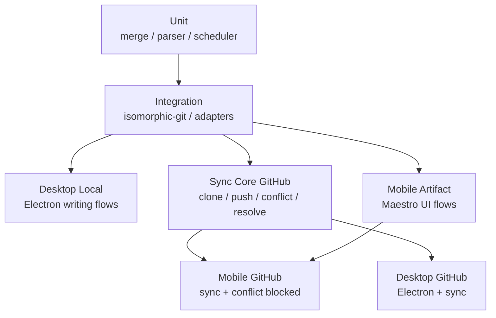
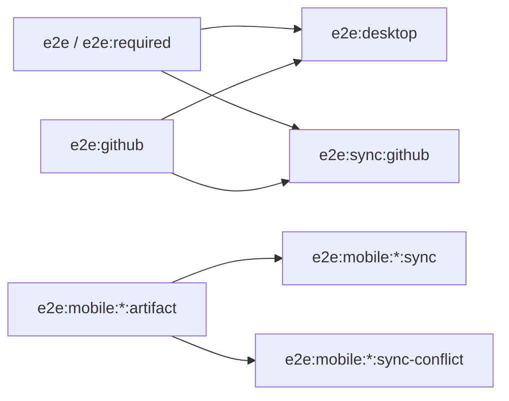
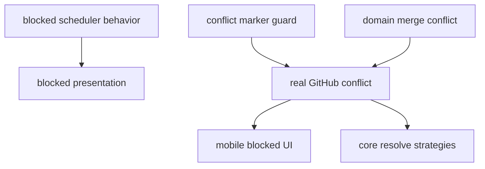
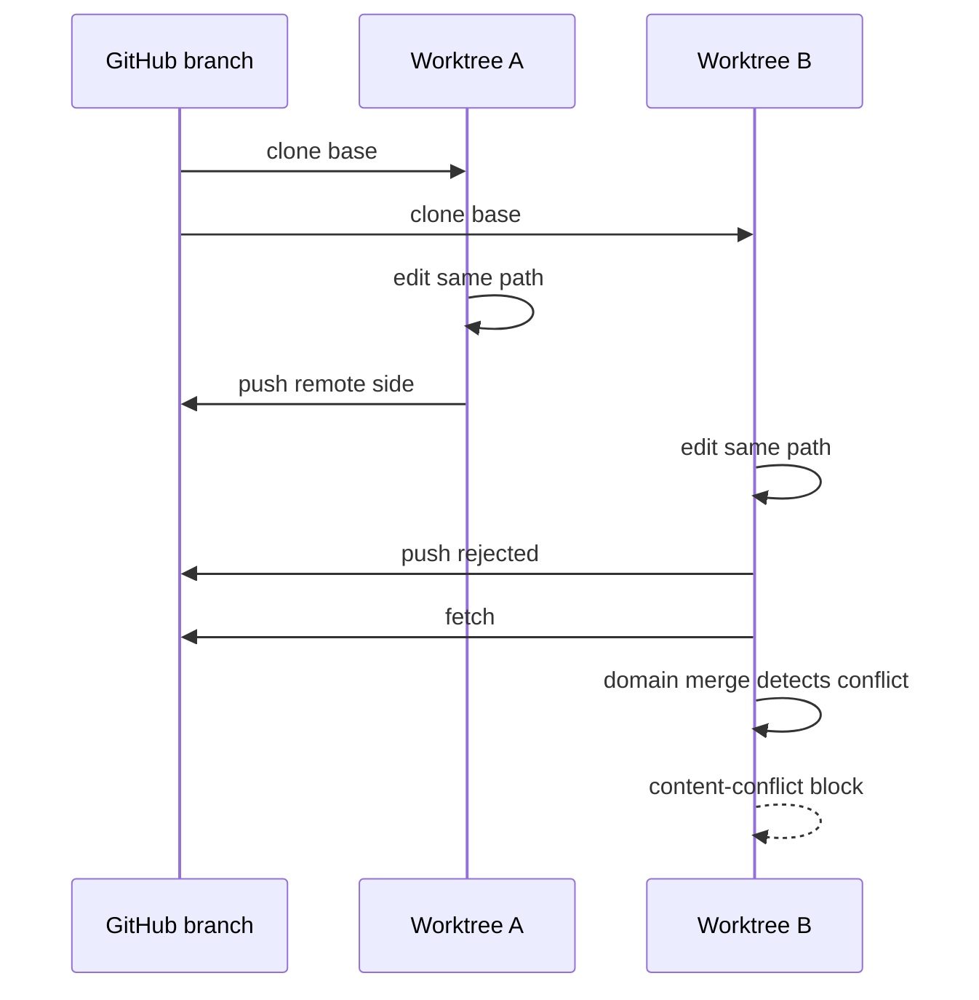
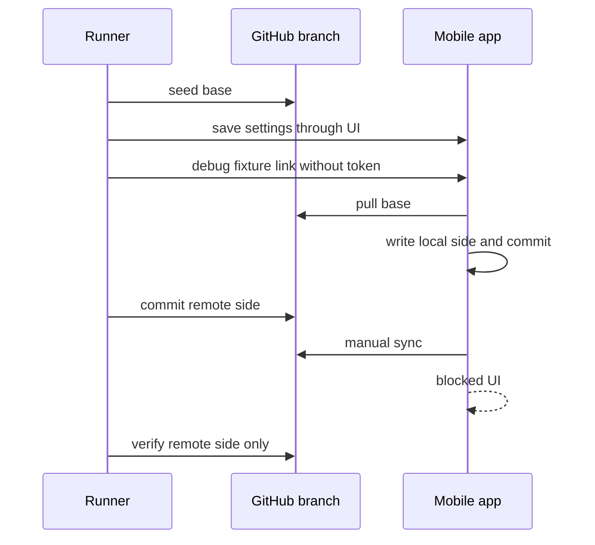
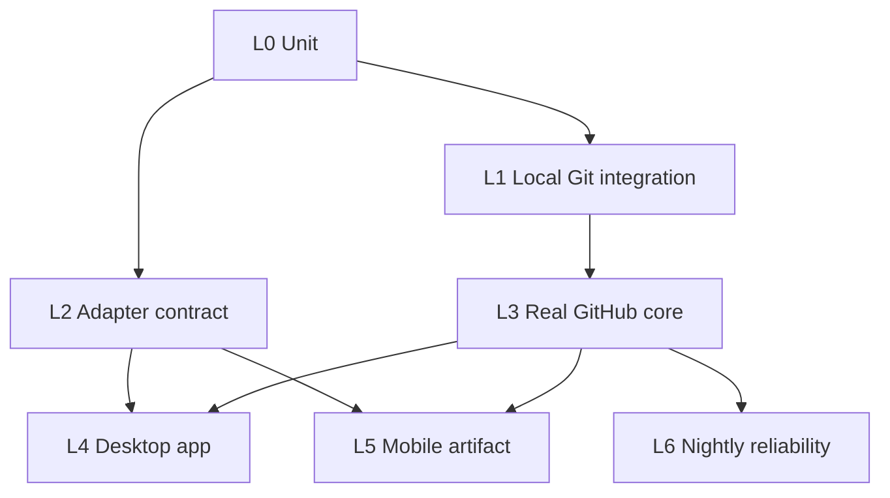

# E2E 覆盖与设计

更新时间：2026-06-17

这份文档记录 E2E 覆盖现状、缺口和设计原则。运行手册见 [E2E 测试](./README.md)。

## 结论

当前 E2E 已经能证明：

- 桌面核心写作路径。
- 桌面真实 GitHub 同步 happy path。
- `@journal/sync` 真实 GitHub happy path、幂等、非冲突合并、真实冲突 blocked 和三种选边策略。
- 移动端 artifact 基础路径。
- 移动端真实 GitHub sync happy path。
- 移动端真实 GitHub `content-conflict` blocked，且远端未被污染。

仍需补齐：

- 桌面和移动端 App 层真实选边恢复闭环。
- 更多同步文件类型：delete、media、reviews、annotations、manifest。
- 双端并发、自动调度、弱网和大仓库可靠性。

## 覆盖地图

| 层 | 已覆盖 | 主要缺口 |
| --- | --- | --- |
| Desktop local | 写作、碎碎念、图片预览、删除、日历、坏 Markdown、危险 remote 校验 | 不证明 GitHub |
| Desktop GitHub | 配置保存、真实编辑、立即同步、远端 clone 校验 | 不覆盖冲突和完整配置 UI |
| Sync core GitHub | push/clone、clean、merge、true conflict、`keep-local` / `keep-both` / `keep-remote` | 文件类型矩阵较少 |
| Mobile artifact | 冷启动、长文、碎碎念新增/编辑、回顾、设置校验 | 还缺更多系统版本和设备矩阵 |
| Mobile GitHub | 真实 sync、真实 conflict blocked、远端 marker/未污染校验 | 还没点选边完成恢复 |

## 命令语义

- 默认门禁不包含 mobile Maestro。
- GitHub E2E 缺 `JOURNAL_E2E_GITHUB_REMOTE_URL` 或 `JOURNAL_E2E_GITHUB_TOKEN` 必须失败。
- mobile 必须显式选择 iOS 或 Android，不再根据环境推断平台。
- `sync-blocked-flow.yaml` 是 UI 预览；正式 blocked 验收用真实 GitHub conflict flow。

## Sync Blocked 证据

| 证据 | 说明 |
| --- | --- |
| sync unit/integration | marker 不 commit、true conflict 转 block、blocked 不自动重试 |
| sync GitHub E2E | 两 worktree 真实 push race 后 block，远端不含 local 失败侧和 markers |
| sync resolve E2E | 三种策略都验证本地和远端结果 |
| mobile conflict E2E | App 真实进入 blocked UI，并显示冲突路径和两侧片段 |

还缺 App UI 中点击 `keep-local` / `keep-both` / `keep-remote` 后的真实恢复验证。

## 真实冲突设计

### Sync Core

核心断言：blocked reason、冲突路径、两侧 preview、远端未污染、无 conflict markers、后续选边结果正确。

### Mobile App

这个 flow 证明 App 层会真实遇到 GitHub 冲突并暂停同步。它还没有证明用户选边后的恢复。

## 设计原则

- 一条 E2E 只保护一个高价值用户路径。
- 同步类 E2E 必须同时看 UI 状态和 Git 事实。
- Git 语义优先用真实 GitHub 或本地 git integration；UI fixture 只做预览。
- secret 测试避免 token 进入截图、trace、日志和 commands JSON。
- 失败证据至少包含分支名、trace 关键事件、远端事实或截图摘要。
- 文档更新和脚本入口更新要一起提交。

## 分层建议

| 层 | 放什么 | 不放什么 |
| --- | --- | --- |
| L0 | merge、scheduler、presentation、tracked paths | 真实网络/UI |
| L1 | commit graph、tree、local/remote conflict、resolve result | GitHub API |
| L2 | Electron preload/main、Expo FS/SecureStore、pending paths | 完整用户旅程 |
| L3 | 少量真实 GitHub clone/push/fetch/conflict | 全文件类型矩阵 |
| L4 | 桌面写作、设置、同步、blocked smoke | 复杂 merge 矩阵 |
| L5 | 移动冷启动、写作、设置、sync、conflict blocked | Dev Client 细节 |
| L6 | 大仓库、弱网、重复 sync、性能 trace | PR 必跑 |

## 当前问题

| 优先级 | 问题 | 下一步 |
| --- | --- | --- |
| P0 | mobile conflict flow 需要进入正式验收 | 涉及 sync blocked 时把 `sync-conflict` 纳入必跑清单 |
| P1 | App 层没有真实选边恢复闭环 | mobile/desktop 各补一个策略 smoke |
| P1 | GitHub 文件类型覆盖少 | 补 delete、media、reviews、annotations、manifest |
| P1 | Android artifact 默认正式 app id | 增加 E2E 专用 app id/profile |
| P2 | nightly reliability 不完整 | 建大仓库、弱网、对象库修复和性能 suite |

## 可执行验收标准

| 改动类型 | 至少要跑 | 补充 |
| --- | --- | --- |
| 桌面普通 UI | `pnpm run e2e:desktop:local` | 正式验收跑 `pnpm run e2e` |
| sync core | `pnpm --filter @journal/sync run test` + `pnpm run e2e:sync:github` | GitHub env 必须存在 |
| 桌面 sync UI | `pnpm --filter @journal/desktop run test` + `pnpm run e2e:desktop:sync` | token 不进可见 UI |
| 移动普通 UI | `pnpm --filter @journal/mobile run test` + mobile artifact flow | artifact 要最新 |
| 移动 sync | mobile tests + `pnpm run e2e:mobile:ios:sync` 或 Android 等价命令 | runner 核验 GitHub marker |
| sync blocked | sync tests + `pnpm run e2e:mobile:ios:sync-conflict` 或 Android 等价命令 | debug fixture 不算正式证据 |

## 维护规则

- 新增 E2E 时写清保护路径、依赖环境、失败证据。
- 新增 blocked reason 时补 presentation、桌面 UI、移动 UI，必要时补 fixture。
- 真实 GitHub E2E 只使用专用私有仓库和临时分支。
- 不传播含 token 的 Maestro commands JSON。
- 命令语义变化时同步更新 [E2E 测试](./README.md)。
