# Git 领域学习：commit、快照与合并

这份文档整理 Git 里几个最容易混淆、但理解同步系统时最关键的概念：commit 到底存什么、为什么历史是一张图、merge base 是什么、fast-forward 和 merge commit 又分别意味着什么。

## 1. Commit 不是 diff，而是快照入口

日常看 `git show` 时，Git 会展示某个 commit 相对父提交改了什么，所以很容易把 commit 理解成 diff。更准确的模型是：

```txt
commit = 元信息 + parent 指针 + tree 指针
tree   = 目录结构快照
blob   = 文件内容
```

一个普通 commit 大致长这样：

```txt
commit C
tree T_C
parent B
author Zilin <...> 1718520000 +0800
committer Zilin <...> 1718520000 +0800

Sync journal changes
```

其中 `tree T_C` 才是这个 commit 对应的仓库快照。commit 本身不直接装所有文件内容，而是指向一棵 tree；tree 再指向目录和文件内容。

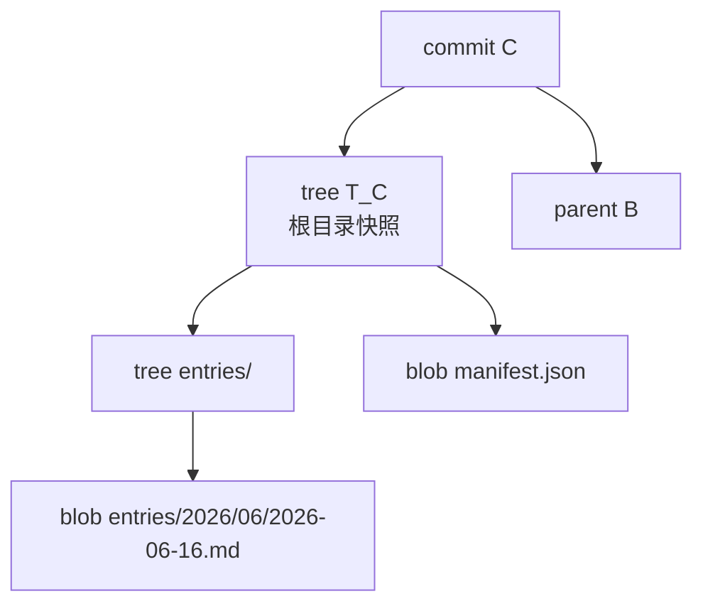

这里要分清两层：

| 层次 | 怎么理解 |
| --- | --- |
| 逻辑模型 | 每个 commit 指向一个完整的仓库快照 |
| 底层存储 | Git 会复用相同对象，packfile 里还可能用 delta 压缩 |

所以说 commit 是快照，不代表每次都完整复制所有文件。没变的文件可以继续指向同一个 blob；压缩存储也不会改变 Git 的概念模型。

## 2. Tree 和 blob 分别存什么

blob 只存文件内容，不存文件名。

```txt
早上写了一句。
桌面补了长文。
手机补了 murmur。
```

tree 存目录结构：文件名、类型、权限，以及它指向的对象 hash。

```txt
040000 tree abcd... entries
100644 blob 1234... manifest.json
040000 tree efgh... media
```

如果进入 `entries/` 这棵 tree，里面还会继续指向下一层目录或具体 Markdown blob。文件名属于 tree，文件内容属于 blob。

## 3. Diff 是两个快照对比出来的视图

当你运行：

```bash
git diff B C
```

Git 做的是比较：

```txt
B 的 tree
vs
C 的 tree
```

差异结果是临时算出来的视图，不是 commit 的核心存储形态。

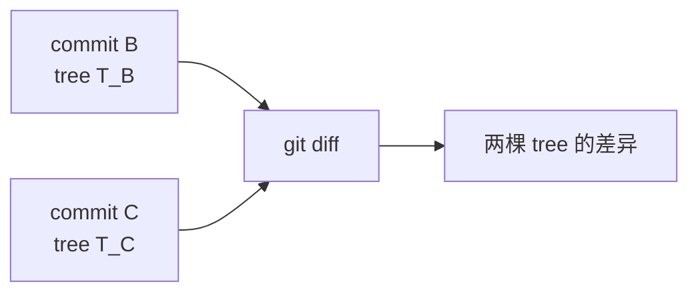

`git show C` 也是类似逻辑：如果 `C` 只有一个 parent，Git 就比较 `parent` 的 tree 和 `C` 的 tree。

## 4. Commit history 是一张图

Git 的历史不是纯列表，而是一个有向无环图，通常叫 DAG。

```txt
DAG = Directed Acyclic Graph
```

含义是：

| 特性 | 含义 |
| --- | --- |
| 有向 | commit 指向它的 parent，历史往回指 |
| 无环 | commit 不可能把自己的后代当 parent |
| 图 | 一个 commit 可以有多个 parent |

线性历史只是最简单的情况：

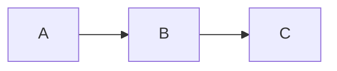

发生分叉和合并后，历史就会长成图：

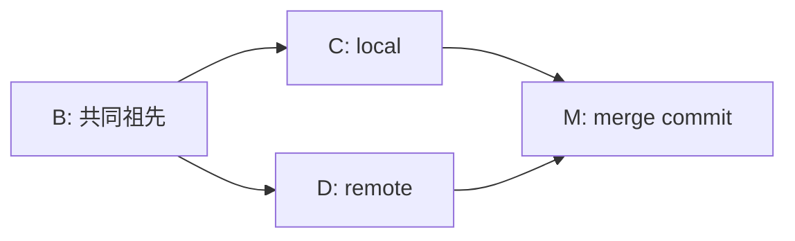

严格按 Git 对象里的 parent 指针看，方向是新 commit 指向旧 commit：

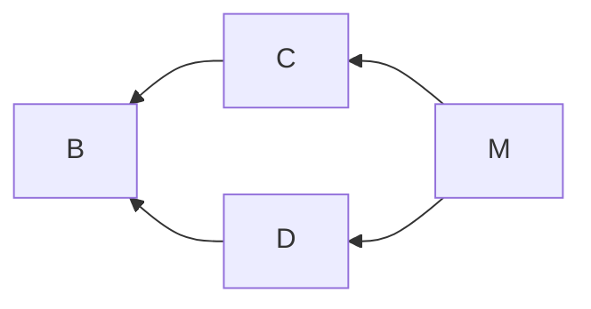

人类读图时通常把时间画成从左到右或从下到上，所以会看到“历史长出去再合回来”。

## 5. Local、remote 和 merge base

同步时常说的三个点：

| 名称 | 含义 |
| --- | --- |
| local | 本地分支当前最新提交，例如 `refs/heads/main` |
| remote | fetch 后的远端跟踪提交，例如 `refs/remotes/origin/main` |
| merge base | local 和 remote 最近的共同祖先 |

比如：

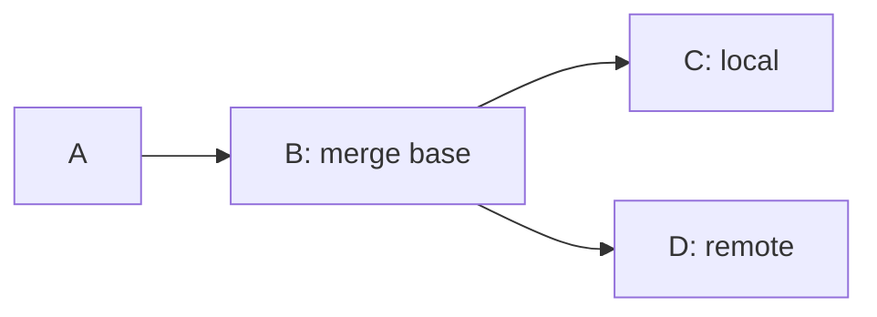

`B` 是两边分叉前共同拥有的最新版本。`C` 是本地后续改动，`D` 是远端后续改动。

## 6. Fast-forward：本地只是落后远端

如果 merge base 就是 local，说明本地没有独有提交，只是停在远端历史的前面。

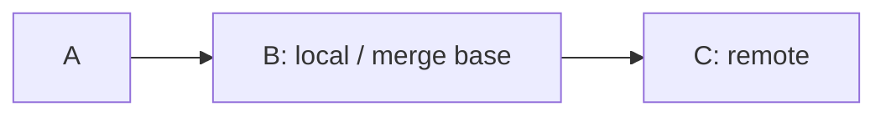

这种情况下不需要创建 merge commit，只要把本地分支指针从 `B` 移到 `C`：

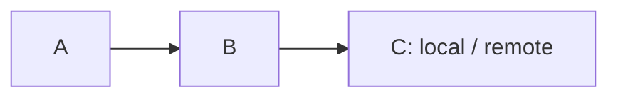

这叫 fast-forward。它不是“同步速度快”，而是“分支指针可以直接向前移动”。

对应关系：

| 判断 | 说明 | 结果 |
| --- | --- | --- |
| `merge base === local` | 本地落后远端 | 可以 fast-forward |
| `merge base === remote` | 远端已经被本地包含 | 通常是 already merged |
| `merge base` 既不是 local 也不是 remote | 两边都各自前进过 | 需要真正合并 |

## 7. 分叉后合并：为什么需要 merge commit

当 merge base 既不是 local，也不是 remote，说明两边都从共同祖先出发，各自提交了新内容。

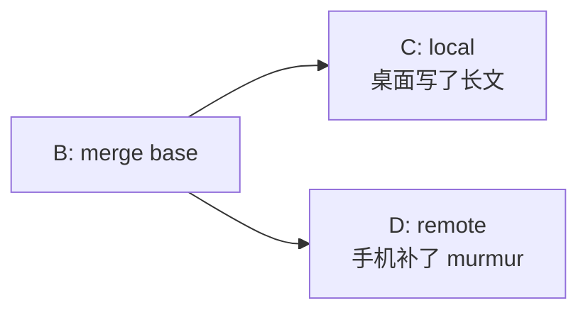

此时 Git 不能只移动指针。移到 `C` 会丢掉 `D` 的历史；移到 `D` 会丢掉 `C` 的历史。正确做法是创建一个新的 merge commit：

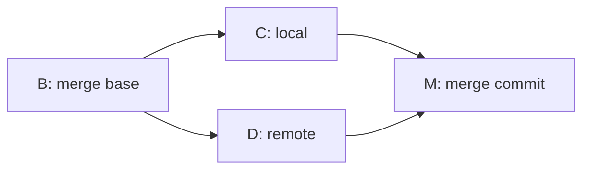

`M` 有两个 parent：

```txt
commit M
tree T_M
parent C
parent D
author Journal Sync <...>
committer Journal Sync <...>

Merge branch 'refs/remotes/origin/main' into refs/heads/main
```

这里最重要的是：

| 字段 | 含义 |
| --- | --- |
| `tree T_M` | 合并后的完整仓库快照 |
| `parent C` | 本地分支合并前的最新提交 |
| `parent D` | 远端分支合并前的最新提交 |
| message | 说明这是一次合并 |

合并成功并 push 后，历史里会同时包含 `C`、`D` 和 `M`：

```txt
*   M  merge commit
|\
| * D  remote 那边的提交
* | C  local 这边的提交
|/
* B  merge base
```

`M` 不是把 `C` 和 `D` 压扁成一个提交；它是在保留两边历史的基础上，新增一个“合并后的最终状态”。

## 8. Merge commit 的 tree 是怎么算出来的

merge commit 依然是快照。特殊之处不是 tree，而是 parent 有两个。

合并前可能是：

```txt
B:
entries/2026/06/2026-06-16.md = "早上写了一句"

C local:
entries/2026/06/2026-06-16.md = "早上写了一句\n桌面补了长文"

D remote:
entries/2026/06/2026-06-16.md = "早上写了一句\n手机补了 murmur"
```

合并后的 `M` 可能是：

```txt
M:
entries/2026/06/2026-06-16.md = "早上写了一句\n桌面补了长文\n手机补了 murmur"
```

概念上，合并过程是在回答一个问题：

> 基于共同祖先 B，本地变成 C，远端变成 D，那么最终快照 T_M 应该长什么样？

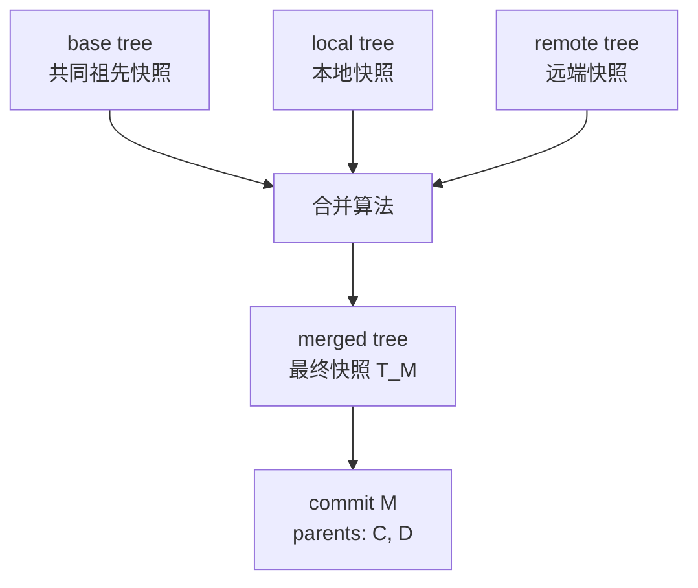

在 `journal-sync` 里，这一步不是盲目调用 Git 默认 merge，而是使用日记领域规则：

| 路径 | 合并策略 |
| --- | --- |
| Markdown 日记 | 先文本 diff3，必要时尝试日记结构化合并 |
| JSON 结构文件 | 能读时间字段时选择较新内容，否则按默认侧选边 |
| media 等非文本 | 不做文本合并，按规则选边 |
| 无法自动判断的冲突 | 不写 merge commit，进入阻断状态 |

这也是为什么 merge commit 可以同时保留本地和远端历史，又让最终文件内容符合日记应用自己的规则。

## 9. 一句话回顾

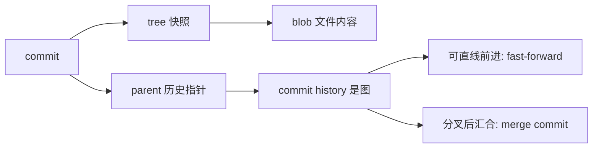

记住这几个点就够用：

- commit 逻辑上是快照入口，不是 diff。
- diff 是两个 commit 的 tree 对比结果。
- Git 历史是一张有向无环图。
- merge base 是两条历史最近的共同祖先。
- fast-forward 是本地没有分叉，只要移动分支指针。
- merge commit 是一个有两个 parent 的普通 commit，它的 tree 是合并后的最终快照。
