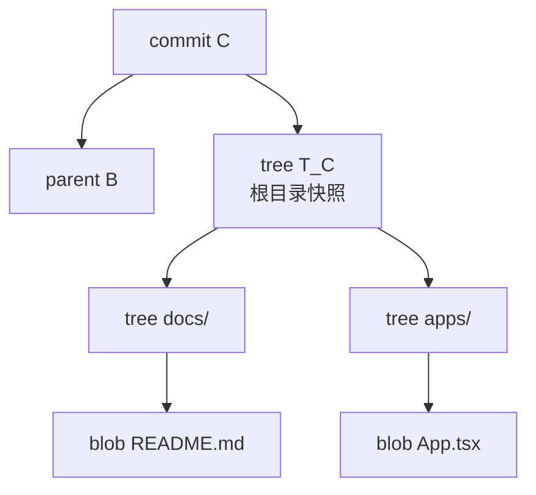
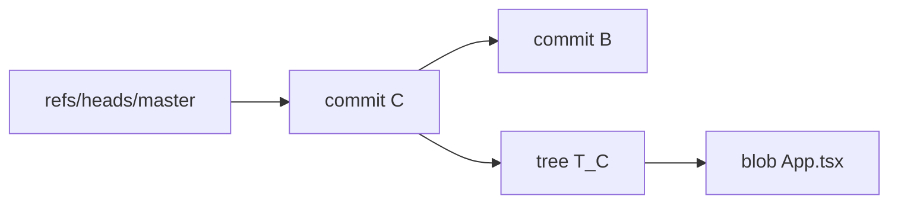
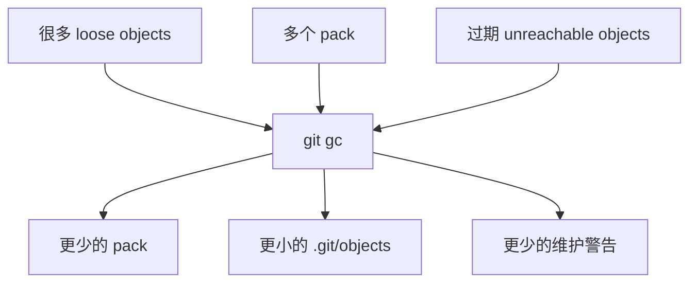

# Git 对象库与 GC：loose object、pack 和 prune

这份文档解释 Git 仓库内部的对象存储和垃圾回收。它适合用来理解这类提示：

```txt
warning: There are too many unreachable loose objects; run 'git prune' to remove them.
warning: garbage found: .git/objects/pack/tmp_pack_xxxxxx
```

这些提示通常不是项目代码出问题，而是 `.git/` 目录里的对象数据库需要维护。

## 1. 工作区和 Git 数据库是两层东西

日常看到的是工作区：

```txt
apps/mobile/src/App.tsx
docs/git-domain-learning/README.md
packages/journal-sync/src/git/core.ts
```

Git 自己还维护一个隐藏数据库：

```txt
.git/
  objects/
  refs/
  logs/
  index
```

`git prune`、`git gc`、`.git/gc.log`、`tmp_pack_*` 都发生在 `.git/` 里面。正常清理不会修改工作区文件，也不会改已有 commit 的内容。

## 2. Git 对象：blob、tree、commit

Git 把仓库内容拆成对象保存：

| 对象 | 存什么 | 类比 |
| --- | --- | --- |
| `blob` | 文件内容 | 某个版本的文件正文 |
| `tree` | 目录结构、文件名、权限、对象 hash | 一个目录快照 |
| `commit` | 作者、时间、message、parent 指针、tree 指针 | 一次历史记录入口 |
| `tag` | 标签元信息 | release 标记 |

一个 commit 大致可以理解成：

```txt
commit C
  parent B
  tree T_C
```

`tree T_C` 再指向目录结构，目录结构里的文件条目再指向具体 blob。



所以 Git 的对象库是一个内容寻址数据库：对象内容会算出 hash，其他对象用这个 hash 来引用它。

## 3. Loose object 是什么

对象刚产生时，可能会以单个文件的形式散落在 `.git/objects/` 下：

```txt
.git/objects/ab/cdef...
.git/objects/12/3456...
```

这种单独保存的对象叫 loose object。

它本身不是坏东西。下面这些操作都可能产生 loose object：

- `git commit`
- `git add`
- `git stash`
- `git merge`
- `git rebase`
- `git commit --amend`
- 失败或中断的 Git 操作

问题只在于：数量太多时，会占空间，也会让 Git 检查对象时变慢。

## 4. Pack 是什么

Git 会把很多对象压缩打包到 packfile：

```txt
.git/objects/pack/pack-xxxx.pack
.git/objects/pack/pack-xxxx.idx
```

| 文件 | 作用 |
| --- | --- |
| `.pack` | 压缩后的对象内容 |
| `.idx` | pack 索引，用来快速找到对象 |

pack 的好处是：

- 减少大量小文件。
- 用 delta 压缩相似对象，节省空间。
- 让 fetch、push、checkout 等操作更高效。

当看到类似：

```txt
packs: 26
```

说明对象分散在 26 个 pack 里。`git gc` 后变成：

```txt
packs: 1
```

表示 Git 把这些包重新整理合并了。

## 5. Reachable 和 unreachable

Git 判断对象是否还能被用到，靠的是“从入口能不能一路找到”。

常见入口包括：

- 当前 `HEAD`
- 本地分支，比如 `refs/heads/master`
- 远端跟踪分支，比如 `refs/remotes/origin/main`
- tag
- stash
- reflog 中还没过期的记录

从这些入口能找到的对象叫 reachable object。



找不到入口引用的对象叫 unreachable object。

典型来源：

| 场景 | 为什么会产生 unreachable |
| --- | --- |
| `git commit --amend` | 旧 commit 被新 commit 替代 |
| `git rebase` | 原提交被重写成一串新提交 |
| `git reset` | 分支指针移走，旧提交不再被分支引用 |
| 临时 merge 后撤销 | 中间对象不再属于当前历史 |
| 大文件 add 后又取消 | 内容对象可能短期残留 |

unreachable 不一定马上危险。Git 会保留一段时间，给 reflog 留“后悔药”。过期后，GC 可以删除它们。

## 6. `git gc` 做什么

`git gc` 是 garbage collection，垃圾回收。它主要做这些事：

```txt
整理 loose objects
合并和压缩 pack
删除过期 unreachable objects
清理临时对象
优化对象索引
```

可以把它理解成：



Git 平时会自动运行 GC。比如 commit 后出现：

```txt
Auto packing the repository in background for optimum performance.
```

就是 Git 在尝试后台整理对象库。

## 7. `git prune` 做什么

`git prune` 更直接：删除当前已经不可达、且满足过期条件的 loose objects。

当 Git 提示：

```txt
There are too many unreachable loose objects; run 'git prune'
```

意思是 `.git/objects` 里有太多当前历史不再引用的散对象。按提示运行：

```bash
git prune
```

通常可以先把这类散对象清掉，然后再运行：

```bash
git gc
```

让 Git 重新整理 pack。

## 8. `.git/gc.log` 为什么会阻止自动清理

如果自动 GC 失败，Git 会留下：

```txt
.git/gc.log
```

只要这个文件还在，Git 会暂停后续自动 GC。它这么做是为了避免每次运行 Git 命令都重复触发同一个失败。

处理方式是：

1. 读 `.git/gc.log`，确认失败原因。
2. 按日志提示修复，比如运行 `git prune`。
3. 确认 `git gc` 能成功。
4. 删除 `.git/gc.log`。

不要在没看原因时盲目删除日志。日志本身不是问题，但它记录了自动 GC 停下来的原因。

## 9. `tmp_pack_*` 是什么

Git 打包对象时会先生成临时 pack 文件：

```txt
.git/objects/pack/tmp_pack_xxxxxx
```

正常情况下，打包成功后临时文件会被替换成正式的：

```txt
pack-xxxx.pack
pack-xxxx.idx
```

如果 Git 操作中断、进程退出、磁盘或权限异常，就可能留下 `tmp_pack_*`。`git count-objects -vH` 可能会显示：

```txt
garbage: 22
size-garbage: 53.93 MiB
```

这些是对象库里的临时垃圾，不是项目源代码。

## 10. 排查和清理流程

遇到 GC 警告时，建议按这个顺序：

```bash
git status --short
git count-objects -vH
sed -n '1,120p' .git/gc.log 2>/dev/null || true
```

确认工作区状态和日志后，再清理：

```bash
git prune
find .git/objects/pack -maxdepth 1 -type f -name 'tmp_pack_*' -print -delete
rm -f .git/gc.log
git gc
git count-objects -vH
git status --short
```

清理后的健康状态通常类似：

```txt
garbage: 0
size-garbage: 0 bytes
packs: 1
```

`git status --short` 仍然应该为空，表示工作区没有被清理动作修改。

## 11. 安全边界

这些操作一般不会改项目文件，也不会改当前分支的正式历史：

- `git prune`
- `git gc`
- 删除 `.git/gc.log`
- 删除 `.git/objects/pack/tmp_pack_*`

但需要知道一个边界：被 prune 掉的 unreachable objects 可能包含很久以前 amend、rebase、reset 后留下的旧历史。它们本来已经不在当前分支、tag、stash 或有效 reflog 可达范围内；清理后，就更难再靠 Git 内部对象找回。

所以比较稳妥的习惯是：

- 清理前先确认 `git status --short`。
- 如果刚做过复杂 rebase/reset，且还想保留后悔空间，可以先不要急着 prune。
- 普通仓库维护场景下，按 Git 的提示 prune 和 gc 是正常操作。

## 12. 一句话总结

```txt
loose object = Git 对象的散装小文件
pack         = Git 对象的压缩归档
reachable   = 当前历史入口还能找到
unreachable = 当前历史入口找不到，多数是旧操作残片
git prune   = 删除不可达散对象
git gc      = 整理、压缩、回收 Git 对象库
```

它们都属于 `.git/` 内部维护层。理解这层之后，看到 GC 警告时就不用把它和代码改动混在一起看。
