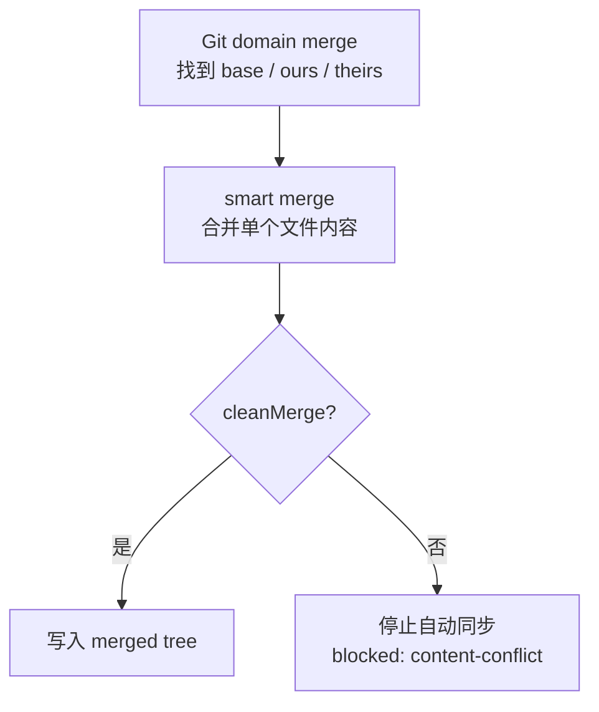
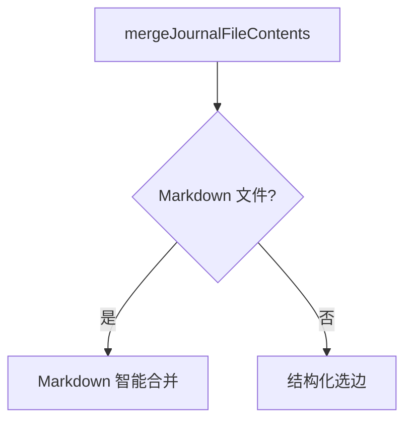
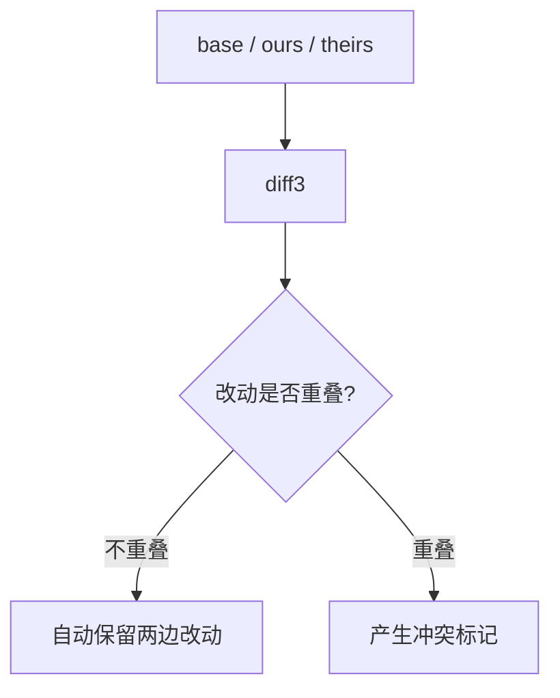
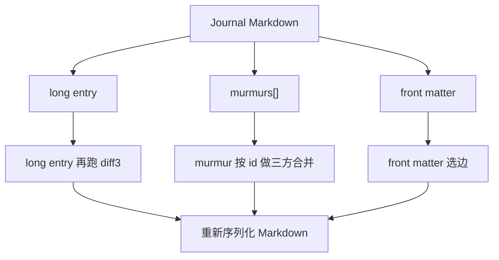
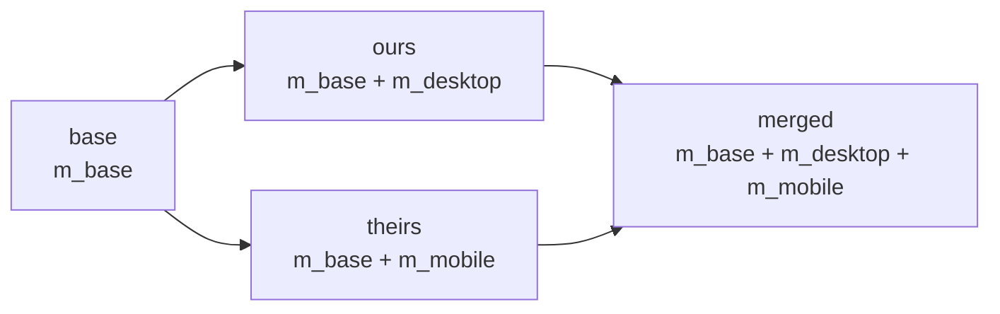
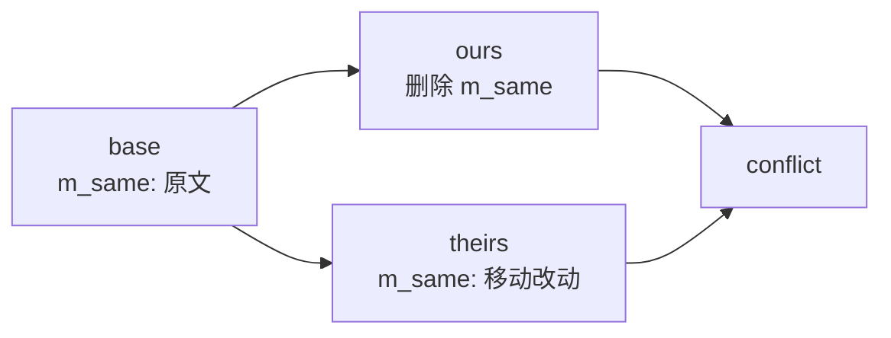
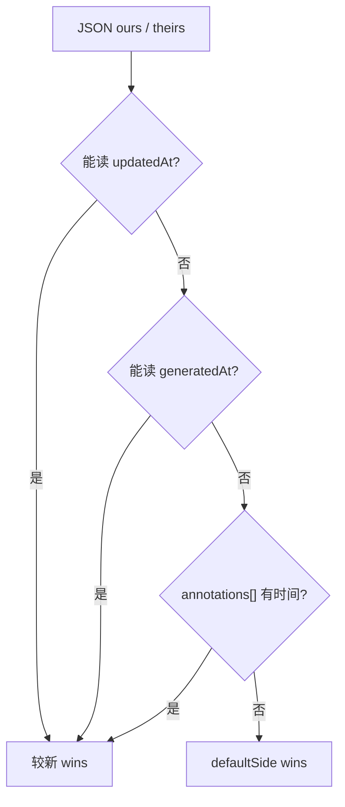
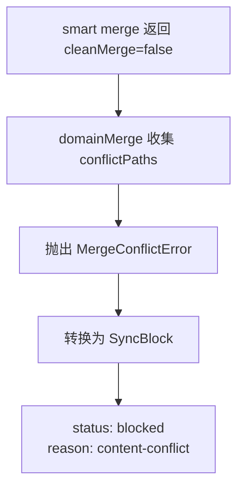
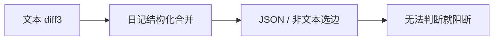

# Journal Sync Smart Merge：日记内容如何自动合并

这份文档解释 `@journal/sync` 里的 smart merge。它不是 Git 的通用合并算法，而是专门为日记文件设计的一层内容合并规则。

## 1. 它解决什么问题

当桌面端和移动端基于同一个旧版本分别改了同一天日记，同步时会出现三份内容：

| 名称 | 含义 |
| --- | --- |
| `base` | 两边共同祖先里的文件内容 |
| `ours` | 本地分支里的文件内容 |
| `theirs` | 远端分支里的文件内容 |

smart merge 只回答一个问题：

> 基于 `base`，`ours` 和 `theirs` 应该合成什么最终文件内容？

它不负责 fetch、找 merge base、写 commit 或 push。这些由 `domainMerge` 和 Git core 处理。



返回值很简单：

```ts
{
  cleanMerge: boolean
  mergedText: string
}
```

`cleanMerge: true` 表示上层可以继续创建 merge commit；`false` 表示无法安全自动判断，上层不会自动提交冲突结果。

## 2. 总体分流

smart merge 的入口按路径分流：



| 文件类型 | 当前策略 |
| --- | --- |
| `.md` 日记 | 先文本 diff3，失败后尝试日记结构化合并 |
| `.json` 结构文件 | 根据时间字段选较新内容，否则按默认侧选边 |
| media 等非文本 | 通常在上层 domain merge 已经按规则选边，不进入文本合并 |

## 3. Markdown：先用 diff3

Markdown 的第一步是普通三方文本合并：



如果两边改的是不同段落，diff3 通常可以直接合并：

```txt
base:
第一段
第二段

ours:
第一段，桌面补充
第二段

theirs:
第一段
第二段，手机补充

merged:
第一段，桌面补充
第二段，手机补充
```

如果两边改了同一行，diff3 会生成冲突标记：

```txt
[conflict ours]
本地版本
[separator]
远端版本
[conflict theirs]
```

这时 smart merge 不会立刻放弃，而是进入日记结构化合并。

## 4. Markdown：再尝试日记结构化合并

日记 Markdown 不是普通文本。它有 front matter、长文正文和 murmur 碎碎念块。结构化合并会先解析出这些部分：



这一步的价值在 murmur。两个端同时追加不同 murmur，在原始 Markdown 文本里可能位置相近，普通 diff3 容易冲突；但按 `id` 看，其实它们是两个独立块，可以同时保留。

## 5. Murmur 合并规则

murmur 的核心原则是：**同一个 `id` 才表示同一个内容块**。不同 `id` 的新增块可以共存。

| 场景 | 结果 |
| --- | --- |
| 两边新增不同 `id` | 都保留 |
| 两边新增同一个 `id` 且内容相同 | 保留一份 |
| 两边新增同一个 `id` 但内容不同 | 冲突 |
| base 里有，一边改了，另一边没改 | 取改过的一边 |
| base 里有，两边改成一样 | 保留一份 |
| base 里有，两边改成不同内容 | 冲突 |
| 一边删除，另一边没改 | 删除 |
| 一边删除，另一边修改 | 冲突 |
| 两边都删除 | 删除 |

可以自动合并的典型情况：



不能自动判断的典型情况：



删除和修改同时发生时，系统不能替用户决定“删除更重要”还是“修改更重要”，所以会停止自动同步。

## 6. Long entry 和 front matter

long entry 仍然走 diff3。它适合处理正文中不同段落的并发编辑，但同一句话被两边改成不同内容时仍会冲突。

front matter 不做字段级深度合并，而是选边：

| 场景 | 结果 |
| --- | --- |
| 两边一样 | 取 `ours` |
| 只有远端改了 | 取 `theirs` |
| 只有本地改了 | 取 `ours` |
| 两边都改了 | 比较 `updatedAt`，较新的 wins |
| 时间不可比或相同 | 偏 `ours` |

这是一种保守策略：front matter 通常是元信息，不适合在没有明确领域规则时随意拼字段。

## 7. JSON：按时间戳选边

非 Markdown 内容会走结构化选边，不做深度合并。



当前会识别：

| 字段 | 用途 |
| --- | --- |
| `updatedAt` | 优先作为文件更新时间 |
| `generatedAt` | 可作为生成类文件时间 |
| `annotations[].updatedAt` | annotation 列表里的最新更新时间 |
| `annotations[].createdAt` | 没有 updatedAt 时的创建时间 |

这意味着 annotations / reviews 目前不是数组元素级合并，而是文件级选边。它简单、可预测，也避免在结构不稳定时做危险猜测。

## 8. 合并失败后发生什么

smart merge 如果返回 `cleanMerge: false`，上层会把这个路径视为 true conflict。



重点是：**冲突内容不会被自动 commit，也不会被自动 push 到远端**。用户需要先处理冲突，之后才能继续同步。

## 9. 一句话总结

smart merge 是三层策略：



它的目标不是“永远自动合并”，而是：

- 能确定安全时，尽量保留桌面和移动端两边的内容。
- 无法确定用户意图时，停止自动同步。
- 不把冲突标记或危险猜测推到远端。
