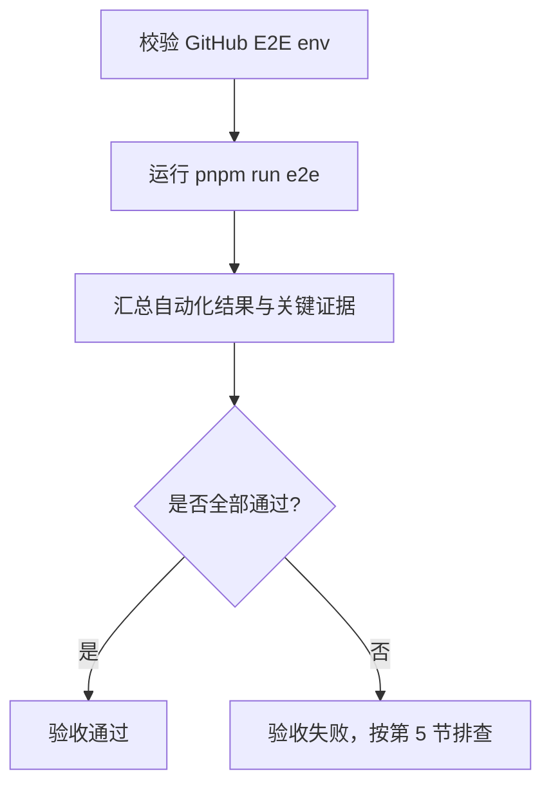
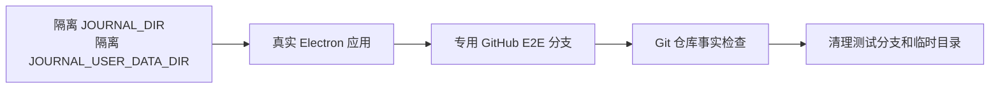
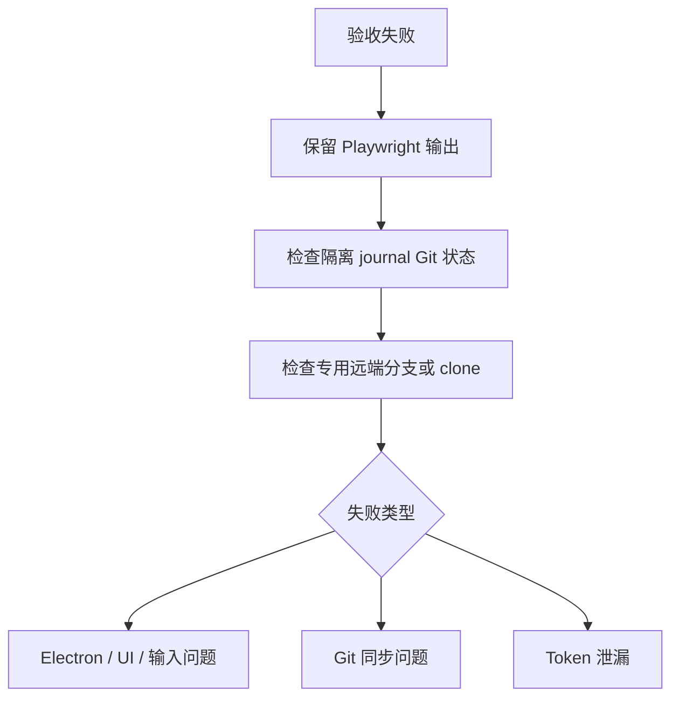

# Electron 桌面端验收 SOP

这份 SOP 用于桌面端 Electron 应用验收。标准验收只使用隔离数据目录和专用 GitHub E2E 仓库；不使用真实 `~/.journal`，不使用真实日记远端。

## 1. 前置条件

必须从 monorepo 根目录执行。

必须配置专用 GitHub E2E 仓库：

```sh
export JOURNAL_E2E_GITHUB_REMOTE_URL=https://github.com/<owner>/<e2e-private-repo>.git
export JOURNAL_E2E_GITHUB_TOKEN=<fine-grained-token>
```

可选配置：

```sh
export JOURNAL_E2E_GITHUB_USERNAME=x-access-token
export JOURNAL_E2E_GITHUB_BRANCH_PREFIX=e2e/playwright
export JOURNAL_E2E_GITHUB_KEEP_BRANCH=1
```

标准命令会先校验必填 env。缺少 env 时不要继续验收。

## 2. 标准流程



标准命令：

```sh
: "${JOURNAL_E2E_GITHUB_REMOTE_URL:?missing JOURNAL_E2E_GITHUB_REMOTE_URL}"
: "${JOURNAL_E2E_GITHUB_TOKEN:?missing JOURNAL_E2E_GITHUB_TOKEN}"
pnpm run e2e
```

验收结论只认这条完整流程。拆分运行、缺少 GitHub env、同步测试 skipped，都只能算开发调试，不能算桌面端验收通过。

## 3. 流程保证



硬性约束：

- 设置 `JOURNAL_DISABLE_WEATHER=1`，避免天气网络影响验收。
- 不读取或写入真实 `~/.journal`。
- 不使用真实日记远端。
- 失败输出不能包含 GitHub token。

## 4. 通过标准

命令退出码必须为 0，并且同步相关断言不能被跳过。

验收证据必须证明：

- 本地隔离 journal 没有同步范围内的未提交改动。
- 本地 Git 仓库没有游离 `HEAD` 或短 ref 残留。
- 专用远端分支与本轮写入结果一致。
- 远端 clone 后仓库状态干净。

同步范围只检查：

```txt
entries/
media/
annotations/
reviews/
manifest.json
```

## 5. 失败处理



失败时优先保留图中三类证据，并补充：

- 失败截图或 trace。
- 同步测试使用的 E2E 分支名。

失败判定：

| 信号 | 结论 |
| --- | --- |
| 缺少 `JOURNAL_E2E_GITHUB_REMOTE_URL` 或 `JOURNAL_E2E_GITHUB_TOKEN` | 验收无效 |
| GitHub 同步测试 skipped | 验收无效 |
| `HEAD` 没有附着在 `refs/heads/<branch>` | 同步失败 |
| `.git/main` 存在 | 同步失败 |
| 同步范围内有未提交改动 | 同步失败 |
| 本地显示已同步但远端 clone 没有内容 | 同步失败 |
| 连续输入产生多个不必要提交 | 同步节奏失败 |
| 最新提交没有用户内容，只包含系统元数据 | 同步失败 |
| 输出中出现 token | 立即清理输出，不继续传播 |

## 6. 视觉确认

视觉确认不是单独流程；它是涉及布局、窗口尺寸或交互密度改动时，在完整 E2E 通过后的补充检查。

检查项：

- Electron 窗口真实打开，不是浏览器预览。
- 主界面、编辑区、导航和同步状态没有遮挡、重叠或空白。
- 常见内容长度和弹层状态下布局仍稳定。
- 窗口尺寸约束符合桌面端设计要求。

需要手动打开窗口时，仍然使用隔离目录和同一套 GitHub E2E env；不要切到真实 `~/.journal`。

## 7. 维护规则

- SOP 的验收入口只有完整流程：env preflight + `pnpm run e2e`。
- 拆分运行只能用于失败定位，不能单独作为最终验收结论。
- 测试实现细节留在 E2E 代码中，不写进 SOP 主流程。
- 更新 E2E 脚本时同步更新本 SOP。
