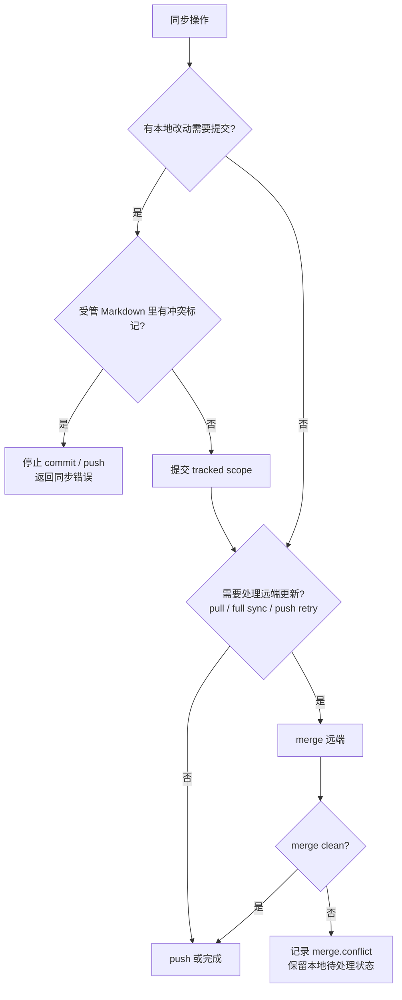

# Git 同步冲突处理

这份文档说明且留现在怎样处理 Git 同步冲突，以及后续还需要补齐哪些能力。

一句话结论：当前实现优先保证“不把危险结果推到远端”。它可以阻断冲突标记、保留本地待处理内容、停止部分历史断裂场景；明确的修复入口放在文末“后续补充”。

## 当前处理流程



## 场景表

| 场景 | 当前怎么处理 | 结果 |
| --- | --- | --- |
| Markdown 非重叠修改 | diff3 自动合并；必要时再尝试日记结构化合并 | clean merge，可以继续同步 |
| Markdown true conflict | merge 结果可能包含 conflict markers，并记录 `merge.conflict` trace | 留在本地待处理，不自动推到远端 |
| 本地 Markdown 已有 conflict markers | commit 前检查 `<<<<<<<` / `>>>>>>>` | 停止 commit / push |
| JSON 有时间字段 | 按 `updatedAt`、`generatedAt` 或 annotation 时间选较新内容 | 自动选边 |
| JSON 或其他文件无可靠时间 | fallback side 选边；当前远端 merge 使用 `theirs` | 自动选边，但不是细粒度 merge |
| pull 前本地有 dirty tracked paths | 不直接 merge 覆盖，返回 dirty paths | 应用侧转成 pending push |
| 首次同步：本地已有内容，远端分支也已有历史 | 停止创建第一条本地 commit | 要先选择保留本地或导入远端 |
| merge 恢复诊断确认无共同祖先 | 抛出 “do not share a common ancestor” 错误 | 停止 commit / push |

## 关键细节

### Markdown 冲突

Markdown 日记走 `smartMerge.ts`：

- 普通文本用 diff3。
- 日记正文和 murmur 能结构化合并时，优先生成 clean merge。
- 无法判断时保留 conflict markers，并增加 `conflictPaths`。
- merge 层记录 `merge.strategy` 和 `merge.conflict` trace。

commit 前还有一道保护：`commitTrackedChanges()` 会调用 `assertNoConflictMarkersInChangedMarkdown()`。如果受管 Markdown 里还有冲突标记，会抛出：

```txt
Journal sync conflict markers remain in <path>. Resolve conflicts before syncing.
```

这意味着 conflict markers 可以留在本地待处理，但不会被自动 stage、commit 或 push。

### 非 Markdown 合并

非 Markdown 现在不是复杂合并，而是安全选边。

| 文件 | 规则 |
| --- | --- |
| `annotations/*.json`、`reviews/*.json` | 能读到时间字段时，取较新的内容 |
| 其他 JSON | 能读到 `updatedAt` / `generatedAt` 时，取较新的内容 |
| 其他文件 | 没有可靠时间字段时按 fallback side 选边 |

这个规则适合当前结构化文件规模。以后如果 annotations 或 reviews 需要多人细粒度并发编辑，要单独设计结构化 merge。

### 本地脏内容保护

拉取远端更新前，核心会检查 tracked scope：

- 如果本地还有未提交的 entries / media / annotations / reviews / manifest 改动，pull 不会直接覆盖。
- `pullJournalUpdates()` 返回这些 dirty paths。
- 桌面端和移动端再把它们标记成 pending push。

这条规则保护正在写作或刚保存但还没推送的本地内容。

### 历史断裂保护

当前有两层保护，但还不是全局完成态。

| 保护点 | 当前行为 |
| --- | --- |
| 首次本地 commit 前 | 如果本地已有日记内容，且远端分支也已有历史，停止同步并提示先选择方向 |
| merge 恢复诊断 | 如果诊断发现本地和远端没有 merge base，抛出无共同祖先错误并停止 |

已知差距：`runRemoteMerge()` 仍设置了 `allowUnrelatedHistories: true`。所以“无共同祖先一律阻断”还没有完全落地，这是后续要补齐的重点。

## 后续补充

这些能力还需要继续做。当前产品体验仍偏底层：没有专门的 `blocked` 状态，没有结构化冲突错误码，也没有冲突列表、左右对照或保留本机/远端按钮。完成后，再把对应内容移到前面的“当前处理”。

| 优先级 | 要补的能力 | 完成标准 |
| --- | --- | --- |
| P0 | 阻塞状态和结构化错误 | 有 `blocked` 或等价状态；错误能区分 `content-conflict` 和 `unrelated-histories`；不会进入密集 retry |
| P0 | 端侧提示 | 设置页能显示“有内容冲突，需要处理后再同步”或“本机和远端不是同一条同步历史” |
| P1 | 内容冲突处理入口 | 用户能选择保留本机、保留远端或合并为草稿 |
| P1 | 无共同祖先修复入口 | 用户能看见本机/远端摘要，并选择以哪边为主补回独有内容 |
| P2 | 完整处理体验 | 冲突列表、左右 diff、逐段选择、处理后提交摘要 |

处理入口的首版可以很简单：

- 保留本机版本：用本机内容作为最终版本，重新 fetch 后创建解决冲突提交。
- 保留远端版本：用远端内容覆盖本机文件，并刷新当前页面和缓存。
- 合并为草稿：生成包含两边内容的草稿，用户编辑保存，清除 conflict markers 后才能再次同步。

默认不做破坏性 force push。如果未来必须提供 force push，需要单独危险确认，并建议先创建远端备份分支。
