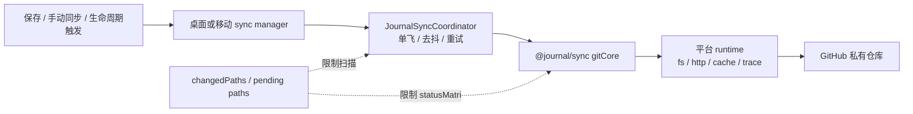
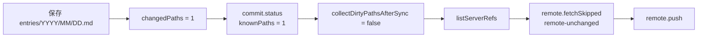
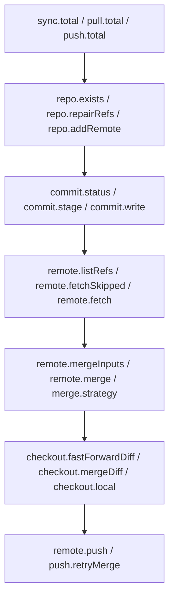
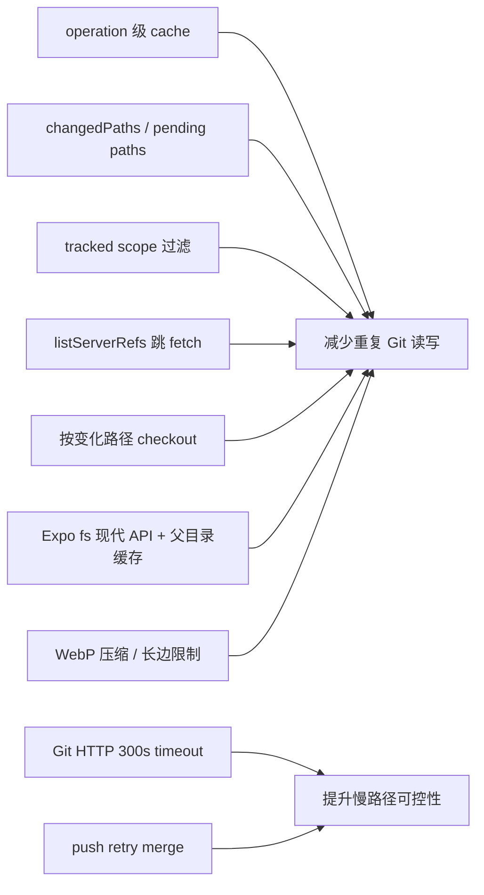

# Git 同步性能笔记

这份文档按当前代码记录 Git 同步链路的性能判断、排查入口、已落地优化和后续可优化点。同步核心在 `packages/journal-sync`，桌面端和移动端只注入平台 runtime 与 UI 编排。

## 1. 当前性能模型



当前耗时主要来自四类成本：

| 成本 | 代码事实 | 观察入口 |
| --- | --- | --- |
| Git object / pack 读写 | 每次 public operation 创建一个 runtime cache，并透传给 `clone`、`fetch`、`merge`、`push`、`checkout`、`add`、`remove`、`commit`、`readCommit`、`statusMatrix`、`walk` | trace 中同一轮操作的 Git step 耗时 |
| worktree 扫描 | `changedPaths` 可把 `commit.status` 限制到明确路径；未知来源才回到 tracked scope | `commit.status` 的 `knownPaths`、`globalFallback`、`rows` |
| 移动端文件系统过桥 | Expo fs adapter 使用 `File.text()` / `File.bytes()` / `File.write()`，并缓存父目录探测 | `status.*`、`checkout.*`、`commit.stage` 在移动端的耗时 |
| 网络和 pack 处理 | pull / full sync 先 `listServerRefs()`，远端 oid 未变时跳过 `fetch()` | `remote.listRefs`、`remote.fetchSkipped`、`remote.fetch`、`http.gitRequest` |

## 2. 性能相关路径

完整同步流程见 [Git 同步机制](<Git 同步机制.md>)。这里只保留会影响性能判断的分支：

| 分支 | 性能影响 |
| --- | --- |
| 保存后带 `changedPaths` | `commit.status` 限制到明确路径，避免全量 tracked scope 扫描 |
| 移动端 pending paths 持久化 | 重启、失败重试、debounce 后仍保留待推送路径 |
| `pushJournalChanges()` 不预先 fetch | 普通保存推送少一次网络往返；只有 push rejected 才 fetch / merge / retry |
| pull 前 dirty 保护 | 本地有未提交 tracked paths 时返回 dirty paths，让应用转 pending push |
| first commit bootstrap | 新设备本地已有内容且远端已有分支时，会保护本地 paths 并合并重叠文件 |
| 按变化路径 checkout | fast-forward / merge 后用 `git.walk()` 计算变化路径，只 checkout 变化的 tracked paths |

`changedPaths` 不是 isomorphic-git 的 `filepaths` 直通语义。空 `changedPaths` 只能代表“本轮没有已知待提交路径”；首次同步要判断本地是否确实为空时，core 会扫描受管范围，或由调用方显式声明 `firstSyncLocalContent: 'empty'`。

## 3. 快路径与慢路径

保存一篇普通日记的理想快路径：



慢路径通常来自：

| 慢路径 | 触发条件 | 主要 trace |
| --- | --- | --- |
| 全量 tracked scope 扫描 | 没有可靠 `changedPaths`，或需要读取 status / dirty paths | `status.matrix`、`commit.status` |
| 远端有更新 | `listServerRefs()` 发现远端 oid 与 tracking 不一致 | `remote.fetch`、`remote.merge` |
| 本地或远端分支需要修复 | detached HEAD、旧 `.git/main` 短 ref、merge 内部错误 | `repo.repairRefs`、`remote.mergeRepair`、`remote.mergeRecoveryDiagnostics` |
| 首次同步已有远端分支 | 本地 worktree 有 dirty paths，但本地分支还没有 commit | `bootstrap.*` |
| push retry | push 被远端更新拒绝 | `push.retryMerge` |
| 移动端大 pack / 大图片 | `expo/fetch` 会把 Git HTTP request / response 聚合成 `Uint8Array` | `http.gitRequest` |

## 4. Trace 关注点

trace 是当前最可靠的性能排查入口。桌面端通过 console trace；移动端非测试环境也默认走 console trace，并额外记录 Git HTTP 请求。



优先看这些字段：

| 事件或字段 | 说明 |
| --- | --- |
| `mobile.operation.changedPathCount` | 移动端本轮是否带上 pending changed paths |
| `mobile.operation.collectDirtyPathsAfterSync` | 有明确 paths 时是否跳过同步后的 dirty 扫描 |
| `commit.status.knownPaths` | `statusMatrix` 是否被限制到已知路径 |
| `commit.status.globalFallback` | 是否退回全量 tracked scope |
| `remote.fetchSkipped.reason` | fetch 跳过原因，目前主要是 `remote-unchanged` |
| `pull.postFetchDirtyStatus.skipped` | 已知 paths 场景下是否跳过 pull 前 dirty 扫描 |
| `merge.strategy` | Markdown / JSON 合并策略统计：`markdownPaths`、`journalStructurePaths`、`sideChoicePaths`、`conflictPaths` |
| `checkout.*Diff.paths` | merge / fast-forward 后实际 checkout 的 tracked 路径数量 |
| `http.gitRequest` | 移动端 Git HTTP 方法、host、service、状态码和耗时 |

后续如果需要做性能基线，优先补这些观测项：

- `.git` 大小、`media` 大小、tracked 文件数。
- debug build 中临时采集 fs 调用次数，例如 info / stat / readFile / writeFile。
- 单次 sync 总耗时、fetch 是否跳过、status rows、dirty path 数量。

## 5. 验收建议

单元测试：

```sh
pnpm --filter @journal/sync run test
pnpm --filter @journal/mobile run test
```

真实远端回归：

```sh
pnpm run e2e:sync:github
pnpm run e2e:desktop:sync
```

移动端原生回归：

```sh
pnpm run e2e:mobile:ios:artifact
pnpm run e2e:mobile:android:artifact
```

真实 GitHub 同步回归必须使用专用测试仓库，不使用真实日记仓库；移动端真实同步性能回归使用 `pnpm run e2e:mobile:ios:sync` / `pnpm run e2e:mobile:android:sync`。失败排查时优先看 trace、dirty paths、`.git/HEAD`、最近 commit、通过 `@journal/sync` clone 后的远端内容，以及移动端是否恢复了 pending paths。

性能基线数据集建议：

| 数据集 | 规模 |
| --- | --- |
| 小仓库 | 30 篇日记，无图片 |
| 中仓库 | 365 篇日记，少量图片 |
| 大仓库 | 1000 篇日记，100-300 张压缩图片 |
| 冲突仓库 | 双端同时修改同一 Markdown，触发 fetch / merge / retry |

## 6. 已落地优化



| 优化 | 当前代码位置 | 说明 |
| --- | --- | --- |
| Operation 级 `isomorphic-git` cache | `gitCore.ts`、桌面/移动 runtime | 每次 public operation 创建 cache，操作结束丢弃 |
| 保存后 `changedPaths` 快路径 | `desktopSyncManager.ts`、`mobileSyncManager.ts`、`gitCore.ts` | 限制 `commit.status`，并在有明确 paths 时跳过同步后的 dirty 扫描 |
| Pending changed paths | `scheduler.ts`、`pendingSyncPaths.ts` | debounce、失败重试、移动端重启恢复都保留待推送路径 |
| Tracked scope 过滤 | `gitCore.ts` | 只关注 `entries/`、`media/`、`annotations/`、`reviews/`、`manifest.json`，过滤危险路径和临时路径 |
| 远端未变跳过 fetch | `fetchRemoteIfRemoteChanged()` | 通过 `listServerRefs()` 比较远端分支 oid 和 remote tracking oid |
| pre-merge dirty 保护 | `getDirtyTrackedPathsBeforeMerge()` | pull 不覆盖未提交本地内容；应用层会把 dirty paths 转为 pending push |
| first commit bootstrap | `prepareFirstCommitOnRemoteIfNeeded()` | 新设备已有本地改动且远端已有分支时，保护本地 paths 并合并重叠文件 |
| 按变化路径 checkout | `getChangedTrackedPathsBetweenRefs()` | fast-forward / merge 后只 checkout 变化的 tracked paths |
| push retry | `pushRemoteWithRetry()` | push 被远端更新拒绝时 fetch / merge 后重试一次，true conflict 会停止 |
| Expo fs 优化 | `expoGitFileSystem.ts` | 现代 File API 优先，legacy API fallback，父目录存在性在 adapter 实例内缓存 |
| 导入图片压缩 | `journalMedia.ts`、`mobileJournalStore.ts` | 非 GIF 图片导入时转 WebP，长边限制 2560，质量约 85%，失败时回退原图 |
| Git HTTP trace 和 timeout | `gitCore.ts`、`journalSync.ts`、`mobileGitSync.ts` | 共享 HTTP client 支持 300s request/body timeout；移动端额外记录 `http.gitRequest` |

## 7. 后续可优化点

优化建议集中在：减少扫描、减少移动端 fs 调用、控制 pack / media 体积，并让慢路径有清晰 trace。

| 方向 | 触发条件 | 验收 |
| --- | --- | --- |
| 批量 stage 新增和修改 | 多图片导入、批量 review 写入明显变慢 | 将新增/修改路径批量 `git.add`，删除路径继续 `git.remove`；单文件保存行为不变 |
| 现代 Expo metadata API | 移动端 fs metadata 调用仍是瓶颈 | 评估 `Paths.info`、`File.info`、`Directory.info`、`Directory.list`；保持 Node-like 错误码和 `mtimeMs` 语义 |
| `clone` / `fetch` tags 参数 | 首次同步或 fetch pack 明显偏大 | 评估 `noTags: true` 或等价参数；暂不默认 shallow clone |
| 移动端 Git HTTP 流式化 | 大 pack 导致内存峰值或请求超时 | 避免把 request / response 全量聚合到内存；保留 trace 和 timeout |
| 仓库体积治理 | `.git` 或 `media` 持续增长 | 记录 `.git`、`media`、tracked 文件数；评估历史媒体治理和体积提示；不把视频纳入 Git 同步 |
| 本地重建入口 | worktree / `.git` 难以修复 | 先确认远端可用和本地无未推送内容，再重建本地同步副本 |
| 性能指标面板 | trace 日志不足以判断趋势 | 汇总最近 sync 耗时、fetch 是否跳过、status rows、dirty paths 和 repo 大小 |

风险控制：

| 方向 | 风险 | 控制 |
| --- | --- | --- |
| 批量 add / parallel | 批量文件时内存峰值升高 | 只在多路径场景启用，保留单文件路径 |
| 父目录缓存 | 外部删除目录导致缓存短暂失真 | 写失败后清理对应缓存并 fallback mkdir |
| 现代 metadata API | 错误码和时间单位变化 | 单元测试覆盖 `ENOENT` / `ENOTDIR` / `EISDIR` 和毫秒语义 |
| shallow clone | 历史和 merge-base 行为变化 | 不作为默认策略，只做独立真实远端评估 |
| 媒体压缩 | 图片质量下降 | 明确最大尺寸和质量参数，给用户可理解提示 |

暂不推进：

- 替换 `isomorphic-git`：当前桌面端和移动端复用同一套同步核心，替换成本高，且会引入双端行为差异。
- 全局长期 Git cache：移动端内存风险高，当前先用 operation 级 cache。
- 自研 packfile 管理或 Git GC：`isomorphic-git` 没有完整等价 Git GC API，先做仓库体积治理。
- 系统 `git` fallback：会让桌面端和移动端同步行为分叉。
- GitHub REST 文件同步：会绕开 Git merge 语义，除非未来明确放弃 Git 协议路线。
