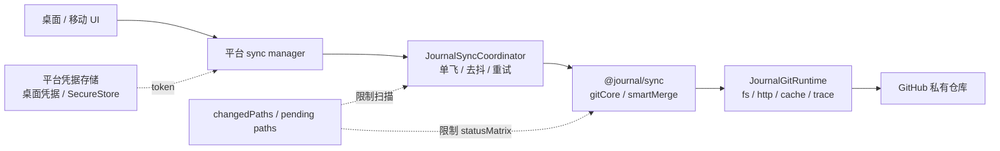
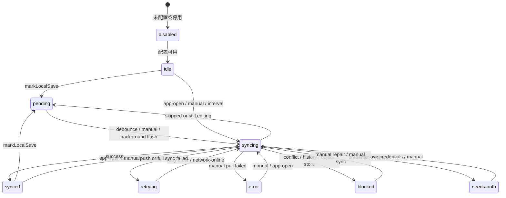
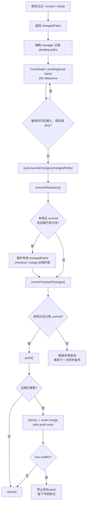
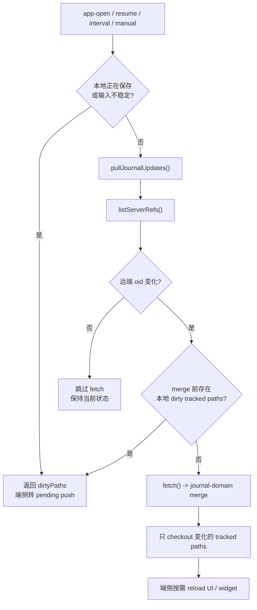
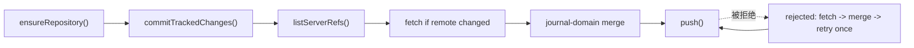
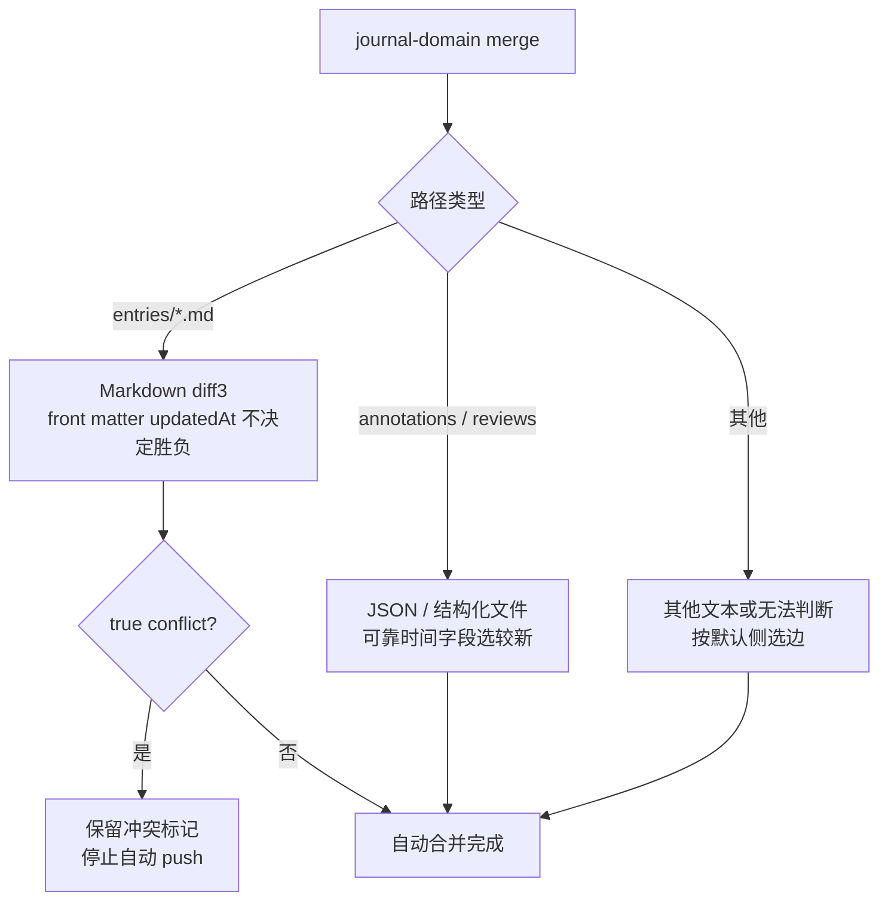

# Git 同步机制

这份文档记录且留当前 GitHub 私有仓库同步的主设计。同步核心在 `packages/journal-sync`，桌面端和移动端只注入平台能力与 UI 编排。

## 1. 总览



核心边界：

- 应用内同步统一使用 `isomorphic-git`。
- 涉及 Git 同步行为和远端内容核对的开发、验收、E2E 检查应复用 `@journal/sync` 或直接使用同一套 `isomorphic-git` runtime。
- E2E 临时分支创建、删除和空仓库 bootstrap 可以使用 GitHub REST 测试夹具；这不参与文件同步协议。
- 不恢复系统 `git` 命令行 fallback，不用 GitHub REST API 重写文件同步协议。
- 远端默认是 GitHub 私有仓库，认证方式是 HTTPS + GitHub token。
- token 不写入 Markdown、Git 仓库或普通配置文件。

## 2. 模块边界

| 层 | 位置 | 职责 |
| --- | --- | --- |
| 同步核心 | `packages/journal-sync/src/gitCore.ts` | init / clone / status / commit / pull / push / full sync 编排 |
| 调度器 | `packages/journal-sync/src/scheduler.ts` | 单飞、排队、保存后延迟推送、定时拉取、后台 flush、失败重试 |
| Git 认证 | `packages/journal-sync/src/gitAuth.ts` | Basic auth header、Git HTTP 超时、认证失败识别 |
| 合并策略 | `packages/journal-sync/src/journalDomainMerge.ts`、`smartMerge.ts`、`structuredFileMerge.ts` | Git tree 领域合并、Markdown diff3、JSON / 非文本选边 |
| 对象库自愈 | `packages/journal-sync/src/gitObjectRepair.ts` | commit 可读性验证、缺失 pack index 重建 |
| 桌面平台适配 | `apps/desktop/electron/journalSync.ts` | Node `fs`、`isomorphic-git/http/node`、桌面凭据、journal directory |
| 桌面 UI 编排 | `apps/desktop/src/services/sync/desktopSyncManager.ts` | 编辑器脏状态、保存 flush、设置页、手动同步、状态展示 |
| 移动平台适配 | `apps/mobile/src/services/sync/mobileGitSync.ts` | Expo 文件系统、`expo/fetch` HTTP client、SecureStore、worktree 目录 |
| 移动 UI 编排 | `apps/mobile/src/services/sync/mobileSyncManager.ts` | 输入稳定性、AppState、pending paths、手动同步、状态展示 |

## 3. Runtime 与配置

共享核心只依赖 `JournalGitRuntime`：

```ts
type JournalGitRuntime = {
  cache: object
  dir: string
  fs: FsClient
  git?: typeof import('isomorphic-git')
  http: HttpClient
  httpRequestTimeoutMs?: number | null
  trace?: JournalGitTrace
}
```

平台层负责创建 runtime：

| 平台 | `fs` | `http` | `dir` |
| --- | --- | --- | --- |
| 桌面端 | Node `fs` | `isomorphic-git/http/node` | 当前 journal directory |
| 移动端 | `createExpoGitFileSystem()` | 包装 `expo/fetch` 的 web client | Expo document directory 下的 `journal-worktree/` |
| 测试 | mock 或临时目录 | mock http | 独立临时目录 |

`runtime.cache` 是单次 public operation 内共享的 `isomorphic-git` cache，操作结束后丢弃。对象库缺失 refetch 节流通过 runtime 注入的 object repair throttle 保持跨操作记忆，避免同一缺失对象反复触发大下载。桌面端和移动端当前 Git HTTP 超时都是 300 秒；移动端额外记录 `http.gitRequest` trace。

`JournalGitSyncConfig` 的默认值：

| 字段 | 默认值 |
| --- | --- |
| `branch` | `main` |
| `remote` | `origin` |
| `commitMessage` | `Sync journal changes` |
| `authorName` / `authorEmail` | 平台层可覆盖，核心有兜底 author |

远端 URL 会经过 `assertSafeRemoteUrl()` 检查，拒绝带用户名或 token 的 URL。认证由 HTTP client 包装层注入 `Authorization: Basic base64(username:token)`；如果调用方已经设置 Authorization header，共享核心不会覆盖。

## 4. 同步范围与操作

Git 同步只关注 journal tracked scope：

```txt
entries/
media/
annotations/
reviews/
manifest.json
```

保存链路应尽量传 `changedPaths`，例如：

```txt
entries/2026/06/2026-06-10.md
media/2026/06/img_20260610_220000.jpg
reviews/2026/06/2026-06-10.json
```

有可靠 `changedPaths` 时，`commitTrackedChanges()` 只检查这些路径；没有可靠路径时才回到整个 tracked scope。

这里要把两层语义分开：

- `changedPaths` 是 journal sync 的业务增量提示，表示“这次保存已知改了哪些受管路径”。空数组只表示“这次没有已知待提交路径”，不代表本地仓库没有日记内容。
- isomorphic-git 的 `filepaths` 是底层 API 的路径限制参数，保持库自身定义；业务层不要用空 `changedPaths` 去改写或推断底层 `filepaths` 语义。
- 首次同步如果需要证明“本地没有内容”，必须使用单独语义，例如 `firstSyncLocalContent: 'empty'`，不能复用 `changedPaths: []`。

共享核心主要 public operations：

| 操作 | 用途 |
| --- | --- |
| `getJournalGitSyncStatus()` | 读取仓库、分支、dirty paths、最近 commit、远端地址 |
| `initJournalGitSyncRepository()` | 初始化本地仓库并配置 author / remote |
| `cloneJournalGitSyncRepository()` | 新设备或空 worktree 从远端 clone |
| `commitJournalChanges()` | 只提交 tracked scope 内的本地改动 |
| `pullJournalUpdates()` | fetch / merge 远端更新到本地 worktree |
| `pushJournalChanges()` | commit 本地改动并 push |
| `syncJournalNow()` | 手动全量同步：commit -> pull -> push |

## 5. 调度状态机



调度器不懂 UI 和文件系统，只决定什么时候跑 `pull`、`push` 或 `full`：

| 规则 | 当前值或行为 |
| --- | --- |
| 单飞 | 同一时间只跑一个 Git 操作 |
| 排队 | 运行中收到新的 pull / push，会在当前操作后补跑 |
| 保存后推送 | `pending(local-save)` 后等待 20 秒 debounce |
| 定时拉取 | 配置后 app open 触发一次，再每 180 秒 pull |
| 后台 flush | 离开 App 时最多等 5 秒推送 pending save |
| 失败重试 | push / full sync 失败后 300 秒 retry |
| 阻断状态 | 内容冲突、首次同步需选择、历史断裂、对象库损坏进入 `blocked`；后台 pull / retry 不会清除阻断，只能由手动处理或手动同步成功清除 |
| 后台 pull | 默认不强行打扰主界面状态 |

触发源是 `app-open`、`app-background`、`manual`、`network-online`、`pull-interval`、`retry-timer`、`save-idle`。

## 6. 保存后自动推送



端侧只需要把保存结果里的 `changedPaths` 交给 coordinator，并在输入不稳定时返回 `skipped`，让 coordinator 继续保持 pending。移动端会额外把 pending paths 持久化，重启后恢复。

## 7. 拉取与手动同步



手动 `syncJournalNow()` 是完整路径：



空远端或空本地有特殊处理：没有本地 commit 时不会强行 push 一个不存在的分支；已有远端分支时会建立本地分支和 tracking。

## 8. 端侧差异

| 流程 | 桌面端 | 移动端 |
| --- | --- | --- |
| 配置保存 | `SettingsPage -> desktopSyncManager.saveConfiguration() -> preload -> Electron main` | `SyncSettingsPage -> mobileSyncManager.saveConfiguration() -> settings + SecureStore` |
| 保存后同步 | 编辑器自动保存后调用 `desktopSyncManager.markLocalSave()` | `saveDailyJournal()` / `loadOrCreateDailyReview()` 后调用 `mobileSyncManager.markLocalSave()` |
| 推送前 gate | 编辑器 dirty 或 composing 时跳过 | 输入不稳定、保存中或 AppState 不适合时跳过 |
| 拉取后刷新 | 当前日期不脏时重新加载 | `reloadTodayFromDiskIfChanged()`，并刷新 widget snapshot |
| 凭据 | 桌面凭据存储 | Expo SecureStore |
| Pending paths | 内存态 | 持久化到移动端 pending paths 文件 |

## 9. 冲突策略



当前不再把 `isomorphic-git.merge()` 作为主路径。`@journal/sync` 使用 `findMergeBase()`、`walk()`、`readBlob()`、`writeBlob()`、`writeTree()`、`writeCommit()` 和 `writeRef()` 自己写 journal-domain merge commit；`isomorphic-git` 仍负责对象库、refs、HTTP transport、status、checkout 和 push/fetch。

冲突策略变更时必须同步更新测试和本文档。性能、trace 和慢路径排查细节见 `docs/product/Git 同步性能笔记.md`。

## 10. 验收事实

同步验收不能只看页面状态，也不要改用系统 `git` 命令绕过应用同步核心。至少通过 `@journal/sync` / `isomorphic-git` 检查这些事实：

- `getJournalGitSyncStatus()` 返回的当前分支、dirty paths、最近 commits 和远端 URL。
- `isomorphic-git.statusMatrix()` 中 tracked scope 是否还有未提交改动。
- `isomorphic-git.currentBranch()` / `resolveRef()` 是否指向完整分支引用，避免游离 `HEAD` 或短 ref。
- 需要核对远端时，用 `isomorphic-git.listServerRefs()` 或 `cloneJournalGitSyncRepository()` 到隔离目录后读取 tracked 内容。
- E2E 中复用 `e2e/githubE2e.ts` 的 `cloneGitHubE2eBranch()`，不要新增系统 `git clone`。
- 需要检查旧 bug 留下的 `.git/main`、`.git/<branch>` 等布局文件时，可以直接读隔离测试目录里的 `.git` 文件；这只是低层回归断言，不是同步 client。

失败信号：

- detached HEAD。
- 短 ref 残留，例如 `.git/main`。
- tracked scope 内长期 dirty。
- 没有用户内容却产生 commit。
- 保存期间产生密集提交或密集重试。
- 页面显示已同步，但远端 clone 后没有对应内容。
