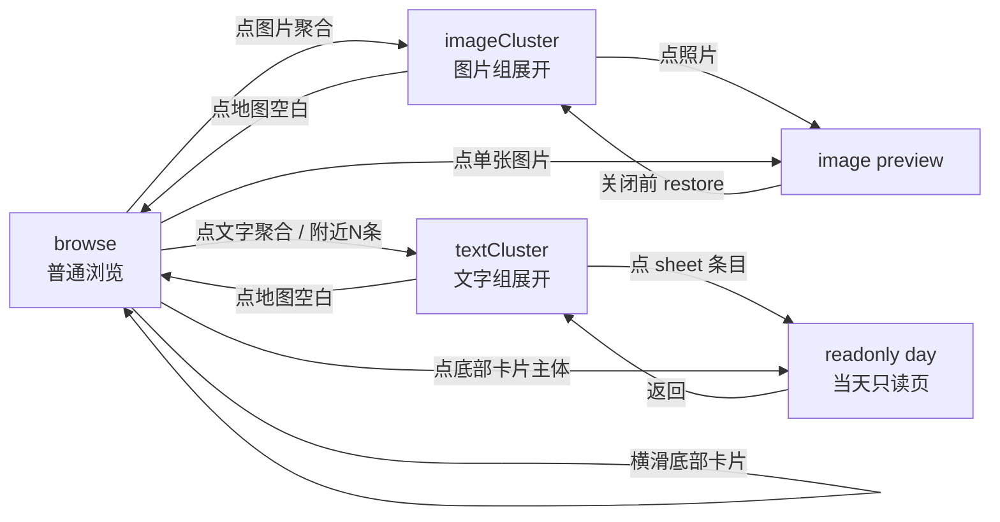
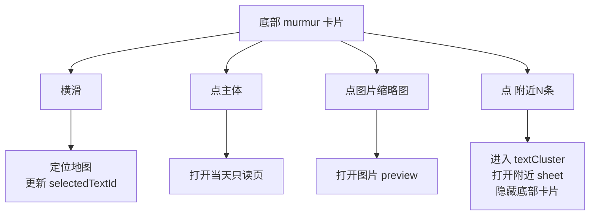

# 照片地图交互流转

这份文档回答“点了某个地方之后，地图、卡片、sheet、preview 应该怎么变化”。产品语义见 [照片地图功能总览](照片地图功能总览.md)，对象关系见 [照片地图数据模型](照片地图数据模型.md)，计算链路见 [照片地图数据流与渲染](照片地图数据流与渲染.md)。

## 1. 状态分层

照片地图的交互不要理解成一个全局选中项，而是几层状态一起工作。

| 状态 | 管什么 | 不管什么 |
| --- | --- | --- |
| `selectedTextId` | 底部 murmur 卡片当前是哪条文字 | 不控制图片 preview，不控制照片 tray |
| `interaction` | 地图当前临时焦点：普通浏览、图片组、文字组 | 不持久保存日记内容 |
| session snapshot | 从只读页返回时恢复 `range`、`interaction` 和 `selectedTextId` | 不保存日记数据，不替代 navigation 状态 |
| image preview modal | 全屏看图，以及关闭后恢复哪里 | 不拥有地图数据 |
| navigation | 进入当天只读页，返回照片地图 | 不重新计算 cluster 语义 |

`selectedTextId` 是相对持久的文字选择；`interaction` 是临时展开态。点击地图空白会清掉 `interaction`，但不会清掉 `selectedTextId`。

## 2. 总状态图

这个图只表达主要路径。实际页面允许从图片组切到文字组，也允许从文字组切到图片组；切换时新的 `interaction` 覆盖旧的 `interaction`。

## 3. 图片交互

### 3.1 单张图片 marker

| 步骤 | 结果 |
| --- | --- |
| 用户点击单张图片 marker | 打开图片 preview |
| 地图相机 | 不移动 |
| 底部 murmur 卡片 | 不切换 |
| 关闭 preview | 回到普通地图浏览，保留原来的文字卡片 |

单张图片 marker 是最短路径：点图就是看图。

### 3.2 图片聚合 marker

| 步骤 | 结果 |
| --- | --- |
| 用户点击图片聚合 marker | `interaction` 进入 `imageCluster` |
| 地图相机 | fit 到该 cluster 范围 |
| 地图 marker | 代表图展开成一组环形缩略图 |
| 底部 UI | 显示照片 tray |
| 底部 murmur 卡片 | 不主动切换 |

图片聚合第一次点击不直接打开 preview。它先回答“这里有哪几张照片”。

### 3.3 从图片组进入 preview

| 步骤 | 结果 |
| --- | --- |
| 点击展开图或 tray 图片 | 打开 gallery preview，保留 initial index |
| preview 打开期间 | 地图现场被遮住，但 `interaction` 不丢 |
| 关闭 preview 前 | 恢复图片组现场 |
| 关闭 preview 后 | 用户看到同一个图片组仍然展开 |

这里的关键是“恢复现场”而不是“重新进入图片组”。关闭大图后不应该先闪回普通地图，再播放一次展开动画。

### 3.4 收起图片组

| 触发 | 结果 |
| --- | --- |
| 点击地图空白 | 清掉 `interaction`，隐藏照片 tray 和展开图 |
| 切换筛选周期 | 清掉 `interaction`，按新范围重新计算 observation 和 cluster |
| 主动进入文字组 | 新的 `textCluster` 覆盖旧图片组 |

## 4. 文字交互

### 4.1 单条文字 marker

| 步骤 | 结果 |
| --- | --- |
| 用户点击单条文字小绿点 | 更新 `selectedTextId` |
| 地图相机 | 移动到该文字坐标 |
| 底部 UI | 展示对应 murmur 卡片 |
| 文字 sheet | 不打开 |

单条文字 marker 是“选中并阅读摘要”，不是直接进只读页。

### 4.2 文字聚合 marker

| 步骤 | 结果 |
| --- | --- |
| 用户点击文字聚合 marker | `interaction` 进入 `textCluster` |
| 地图相机 | fit 到该 cluster 范围 |
| 地图 marker | 展开为多个小绿点 |
| 底部 UI | 显示附近碎碎念 sheet |
| 底部 murmur 卡片 | 临时隐藏 |

文字聚合先展示附近列表，而不是替用户决定哪条最重要。

### 4.3 展开后点击某个小绿点

| 步骤 | 结果 |
| --- | --- |
| 用户点击展开的小绿点 | 更新 `selectedTextId` |
| 地图相机 | 不主动移动；用户仍停留在展开后的附近上下文 |
| 附近 sheet | 保持打开 |
| group 展开态 | 保持打开 |

这个动作只是让当前文字选择变化，不退出附近上下文。底部卡片仍被 sheet 隐藏，但内部 carousel 会同步到这条文字，关闭 sheet 后能回到对应卡片。

### 4.4 点击 sheet 条目

| 步骤 | 结果 |
| --- | --- |
| 用户点击 sheet 中某条碎碎念 | 打开该日期只读页 |
| 进入只读页前 | 页面级 session snapshot 已经保留当前 text cluster、range 和 `selectedTextId` |
| 从只读页返回 | 恢复 sheet 和展开小绿点 |
| 底部 murmur 卡片 | sheet 打开时仍隐藏 |

sheet 是去只读页的入口，不是选择卡片的入口。

### 4.5 点击地图空白

| 步骤 | 结果 |
| --- | --- |
| 用户点击地图空白 | 清掉 `interaction` |
| 附近 sheet | 关闭 |
| 展开小绿点 | 收起 |
| 底部 murmur 卡片 | 恢复显示，仍然使用上一次 `selectedTextId` |

空白点击只关闭临时层，不清除用户刚才读到哪里。

## 5. 底部 murmur 卡片交互

底部卡片有四个独立点击区，不能混在一起。

| 入口 | 行为 | 注意 |
| --- | --- | --- |
| 横向滑动卡片 | snap 后定位地图到当前 murmur | 不打开只读页 |
| 卡片主体 | 打开对应日期只读页 | 拖动期间有 guard，避免误触 |
| 卡片图片缩略图 | 打开图片 preview | 阻止触发外层卡片点击 |
| `附近 N 条` badge | 打开附近碎碎念 sheet，并隐藏卡片 | 行为等同点击对应文字聚合点 |

## 6. 关闭与恢复规则

| 场景 | 应该恢复到哪里 |
| --- | --- |
| 普通图片 preview 关闭 | 回到打开前的普通地图状态 |
| 从图片组打开 preview 后关闭 | 回到同一个图片组展开态 |
| 从 sheet 条目进入只读页后返回 | 回到同一个文字组 sheet 和展开态 |
| 从底部卡片主体进入只读页后返回 | 回到进入只读页前的地图状态；通常是普通地图并保留文字卡片 |
| 点击地图空白 | 回到普通地图，保留上一次文字选择 |

如果用户看到“关闭 preview 后 group 突然收起再展开”，通常说明恢复路径走成了重新进入，而不是 restore。

## 7. 事件处理边界

地图上的 marker 和地图空白点击必须分开。

- marker 自己处理自己的点击，并调用 `event.stopPropagation()`。
- overlay 上的按钮、tray、sheet、badge 也要阻止外层误触发。
- `Map.onPress` 只表示真正点击地图空白。
- `guardOverlayMapPress()` 只是兜底，不能作为主要交互模型。

更底层的 MapLibre 事件机制见 [MapLibre 技术说明与依赖](<MapLibre 技术说明与依赖.md>)。

## 8. 验收清单

- 点单张图片 marker：只打开 preview，不切文字卡片。
- 点图片聚合 marker：地图放大，出现展开缩略图和照片 tray。
- 从照片 tray 进 preview 再关闭：group 仍展开，不重播展开动画。
- 点文字聚合 marker：出现附近 sheet，底部 murmur 卡片隐藏。
- 点展开小绿点：sheet 和 group 保持，只切换当前文字。
- 点 sheet 条目：进当天只读页，返回后 sheet/group 保持。
- 横滑底部卡片：只定位，不打开页面。
- 点底部卡片主体：打开当天只读页。
- 点底部卡片图片：打开图片 preview，不打开只读页。
- 点 `附近 N 条`：打开附近 sheet，卡片先隐藏。
- 点地图空白：关闭 tray/sheet/展开态，恢复底部卡片。
