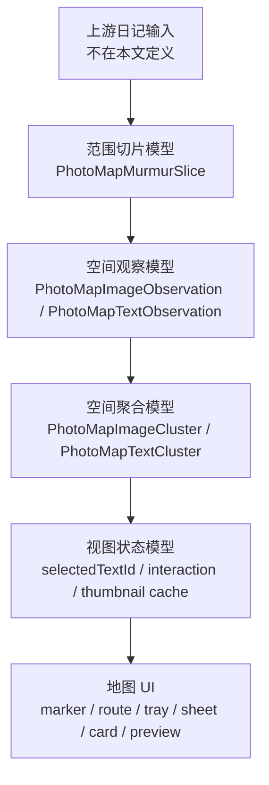
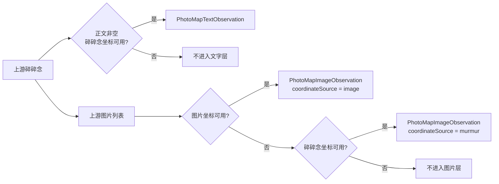

# 照片地图数据模型

这份文档回答“照片地图自己的运行时对象有哪些，它们之间是什么关系，哪些只是临时派生”。它不定义日记原始模型；上游日记结构见 [数据结构](../../architecture/数据结构.md)。它也不描述点击路径，交互见 [照片地图交互流转](照片地图交互流转.md)；不描述函数调用顺序，计算链路见 [照片地图数据流与渲染](照片地图数据流与渲染.md)。

照片地图运行时模型的代码事实以 `apps/mobile/src/pages/photoMapData.ts`、`apps/mobile/src/pages/photoMapInteraction.ts` 和 `apps/mobile/src/pages/photoMapViewModel.ts` 为准。

## 1. 模型分层

照片地图运行时模型分成五层。上游日记内容只是输入，不在本文定义；本文只讲进入照片地图之后的运行时模型。

| 层级 | 主要对象 | 生命周期 | 照片地图是否持久化 |
| --- | --- | --- | --- |
| 上游日记输入 | 由日记数据结构提供 | 由日记系统维护 | 不适用 |
| 范围切片模型 | `PhotoMapMurmurSlice` | 合并当前日与历史日记、按筛选周期生成 | 否 |
| 空间观察模型 | `PhotoMapImageObservation`、`PhotoMapTextObservation` | 当前筛选周期内生成 | 否 |
| 空间聚合模型 | `PhotoMapImageCluster`、`PhotoMapTextCluster` | observation 变化后重新计算 | 否 |
| 视图状态模型 | `selectedTextId`、`interaction`、thumbnail cache | 页面浏览期间变化 | 否 |

## 2. 上游输入边界

照片地图不拥有日记原始模型，也不在本文展开它的 schema。这里只记录照片地图从上游输入中依赖的能力：

| 能力 | 用途 |
| --- | --- |
| 稳定内容 id | 生成 observation id 和 cluster id |
| 日期与时间 | 范围过滤、排序、路线顺序和展示 |
| 可选正文 | 生成文字 observation；空正文不进入文字层 |
| 可选图片列表 | 生成图片 observation 和缩略图 |
| 可选位置 | 生成地图坐标、路线、相机；必要时派生未定位状态 |

如果需要修改这些上游字段或持久化格式，应优先更新 [数据结构](../../architecture/数据结构.md)，而不是在照片地图文档里重新定义一份。

## 3. 范围切片模型

`PhotoMapMurmurSlice` 是照片地图内部的临时输入切片：它把当前日内存数据和历史日记合并后，按当前筛选周期留下需要参与地图计算的 murmur。它不表示地图 marker，也不会写回日记。

| 字段 | 语义 |
| --- | --- |
| `id` | `${date}:${murmur.id}` |
| `kind` | 固定为 `murmur`，只是说明来源是 murmur |
| `body` | 上游 murmur 正文原文 |
| `coordinates` | 可用的 murmur 坐标；无效或缺失时为 `null` |
| `murmur` / `murmurId` | 回到上游 murmur、图片列表和只读页所需引用 |
| `date` / `time` | 范围过滤、排序、路线和展示使用 |

早先把 murmur 与 image 混在同一种地图对象里的模型已经不再使用。地图真正渲染的空间对象是下一层 observation。

## 4. 空间观察模型

Observation 是照片地图讨论里最重要的模型。它表示“一个可以放到地图坐标上的内容对象”。

### PhotoMapTextObservation

一条有正文且有碎碎念坐标的上游内容生成一个文字 observation。

| 字段 | 语义 |
| --- | --- |
| `id` | `${date}:${murmur.id}` |
| `kind` | 固定为 `text-observation` |
| `coordinates` | 只来自 `murmur.location` |
| `body` | trim 后非空的正文 |
| `murmur` / `murmurId` | 回到上游碎碎念和当天只读页需要的引用 |
| `date` / `time` | 卡片、sheet 和排序展示 |

纯图片碎碎念不生成 text observation。

### PhotoMapImageObservation

每张上游图片独立生成一个图片 observation。一条碎碎念有三张图，就会生成三个图片 observation。

| 字段 | 语义 |
| --- | --- |
| `id` | `${date}:${murmur.id}:${image.id}` |
| `kind` | 固定为 `image-observation` |
| `image` | 上游图片引用 |
| `coordinates` | 优先来自 `image.location`，缺失时 fallback 到可用 `murmur.location` |
| `coordinateSource` | `image` 或 `murmur`，标明坐标来源 |
| `body` | 所属 murmur 正文，用于上下文展示 |
| `murmur` / `murmurId` | 回到上游碎碎念需要的引用 |
| `date` / `time` | tray、preview 和排序展示 |

`coordinateSource: 'murmur'` 只表示“为了让图片仍然出现在地图上，使用所属文字坐标”。它不代表这张图片有真实 EXIF 坐标。

## 5. 坐标模型

地图内部坐标统一使用 `[longitude, latitude]`，也就是 GeoJSON / MapLibre 常用顺序。上游位置对象的结构不在本文定义。

坐标来源边界：

| 场景 | 使用什么坐标 |
| --- | --- |
| 文字 observation | 只用 `murmur.location` |
| 图片 observation | 先用 `image.location`，否则 fallback 到 `murmur.location` |
| 路线 | 只用 `murmur.location` |
| 初始相机 | 优先 murmur 坐标；没有时可 fallback 到图片坐标 |
| 未定位计数 | 正文无 murmur 坐标算文字未定位；图片无 image 坐标且无 murmur fallback 算图片未定位。它是运行时派生值，常规统计卡不展示，只用于无可地图内容状态和调试判断 |

具体的坐标可用性判定，例如 `0,0`、越界和非数字过滤，维护在 [照片地图数据流与渲染](照片地图数据流与渲染.md)。

## 6. 空间聚合模型

图片和文字分别聚合，不会混成一个 cluster。

| 模型 | items | marker |
| --- | --- | --- |
| `PhotoMapImageCluster` | `PhotoMapImageObservation[]` | 单图缩略图或 `N张` 图片聚合 marker |
| `PhotoMapTextCluster` | `PhotoMapTextObservation[]` | 单条小绿点或数字文字聚合 marker |

cluster 共有字段：

| 字段 | 语义 |
| --- | --- |
| `id` | 由组内 item id 拼出的稳定 id |
| `kind` | `image-cluster` 或 `text-cluster` |
| `items` | 组内 observation |
| `coordinates` | 组中心点，取组内 item 坐标平均值 |
| `representativeItem` | 组内第一项，用作代表图或代表文字 |

具体聚合半径、距离判断和桥接合并算法维护在 [照片地图数据流与渲染](照片地图数据流与渲染.md)。

## 7. 视图状态模型

这些状态驱动 UI，但不属于日记数据。

| 状态 | 作用 | 维护文档 |
| --- | --- | --- |
| `selectedTextId` | 当前底部 murmur 卡片对应哪条文字 observation | [照片地图交互流转](照片地图交互流转.md) |
| `interaction` | 当前地图焦点是普通浏览、图片组还是文字组 | [照片地图交互流转](照片地图交互流转.md) |
| `range` | 当前筛选周期，决定 murmur slices、observations 和 clusters | [照片地图数据流与渲染](照片地图数据流与渲染.md) |
| thumbnail cache | 地图小图和 tray 小图的缓存 URI | [照片地图数据流与渲染](照片地图数据流与渲染.md) |

`interaction` 的具体状态机不在本文展开，避免和交互文档重复。

## 8. 写回边界

照片地图运行时模型不会写回日记或同步仓库。以下对象都可以重新计算或丢弃：

- `PhotoMapImageObservation`
- `PhotoMapTextObservation`
- `PhotoMapImageCluster`
- `PhotoMapTextCluster`
- `PhotoMapMurmurSlice`
- `selectedTextId`
- `interaction`
- thumbnail cache
- tray / sheet / preview 状态

如果要修改日记原始内容或同步仓库，那已经超出照片地图运行时模型范围，应回到上游数据结构和写入链路讨论。

## 9. 讨论时用哪个名词

| 想讨论的问题 | 推荐名词 |
| --- | --- |
| 日记里原始写了什么 | 上游日记模型，见 [数据结构](../../architecture/数据结构.md) |
| 当前筛选周期里有哪些 murmur 参与计算 | `PhotoMapMurmurSlice` |
| 地图上应该出现几个图片点 | `PhotoMapImageObservation` |
| 地图上应该出现几个文字点 | `PhotoMapTextObservation` |
| 附近几张图片为什么合在一起 | `PhotoMapImageCluster` |
| 附近几条文字为什么合在一起 | `PhotoMapTextCluster` |
| 图片坐标到底来自哪里 | `coordinateSource` |
| 底部卡片当前是哪条 | `selectedTextId` |
| 当前展开的是图片组还是文字组 | `interaction` |
