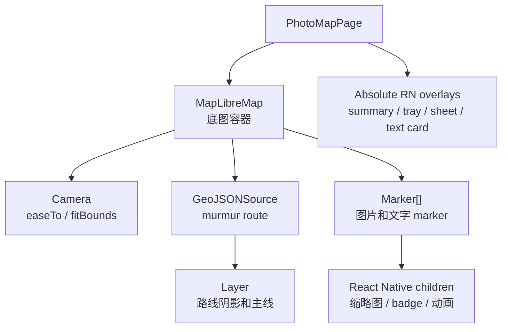
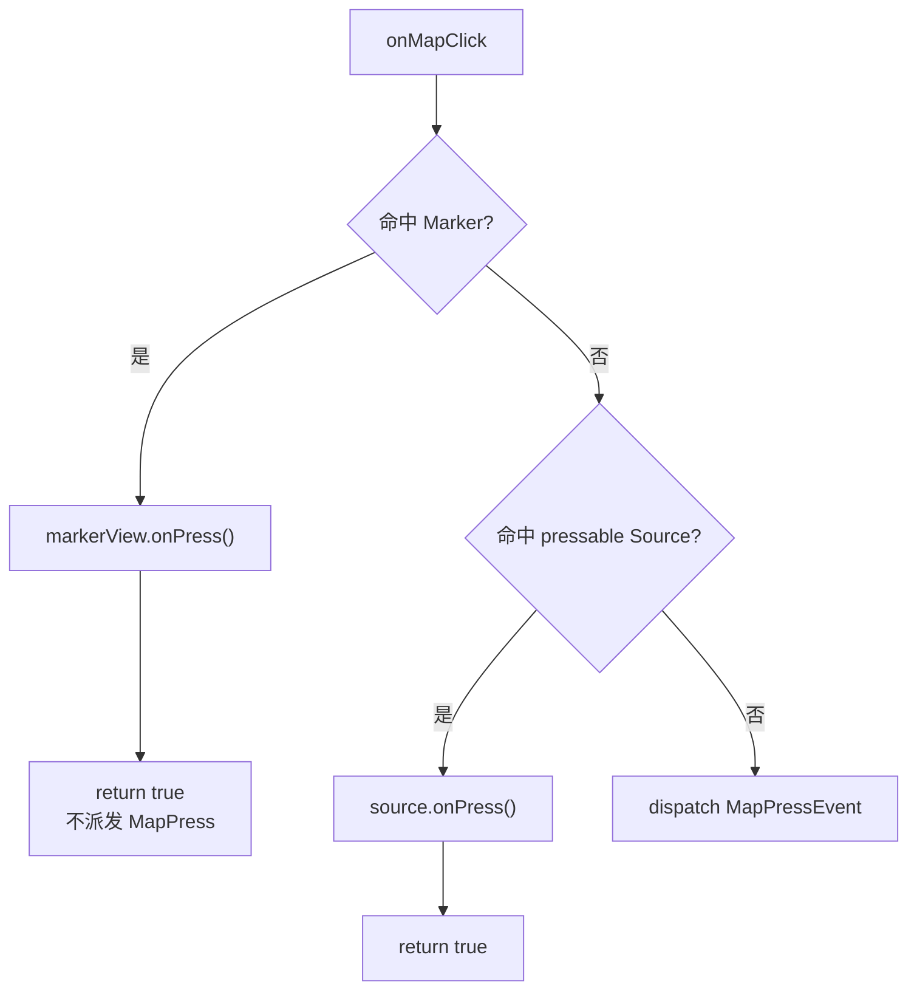

# MapLibre 技术说明与依赖

这份文档记录照片地图当前使用 `@maplibre/maplibre-react-native` 的方式、组件职责、事件机制和相关依赖。当前安装版本是 `@maplibre/maplibre-react-native@11.3.4`，代码事实以本地 `node_modules/@maplibre/maplibre-react-native/src/` 和 `apps/mobile/src/pages/PhotoMapPage.tsx` 为准。

## 1. 当前使用范围

照片地图使用 MapLibre 承载底图、相机、路线和地图坐标上的 marker。业务数据流见 [照片地图数据流与渲染](照片地图数据流与渲染.md)。



当前具体选择：

- `MapLibreMap`：承载地图实例，处理地图空白点击、底图样式、logo、compass、attribution 等配置。
- `Camera`：执行首次定位、聚合点放大、普通文字选择、底部卡片横滑和统计卡定位。
- `GeoJSONSource + Layer`：只用于碎碎念路线，路线来自 murmur 本体坐标。
- `Marker`：用于图片聚合 marker、展开图片 marker、文字聚合 marker、展开文字 marker。
- React Native absolute overlay：用于顶部统计卡、照片 tray、附近碎碎念 sheet、底部文字卡片。

## 2. MapLibre 组件模型

### Map

`Map` 是地图容器。它可以接收 `onPress` / `onLongPress` 等地图事件。照片地图把 `Map.onPress` 当作“点击地图空白”的入口，用来关闭照片 tray、附近碎碎念 sheet 和展开态，但保留底部文字卡片。

注意：`Map.onPress` 不应该承载 marker 的业务选择。marker 自己的点击必须先被各自的事件入口处理，否则容易出现“点 marker 后又被当作空白点击”的状态冲突。

### Camera

`Camera` 负责地图视角，不拥有业务状态。

照片地图里主要有四类相机动作：

- 首次进入：`getPhotoMapInitialCamera()` 给出初始中心和 zoom。
- 主动点击 cluster：`fitBounds()` 动画放大到聚合范围。
- 普通文字选择、横滑底部卡片和统计卡定位：`easeTo()` 移动到对应文字或首个可用内容。
- 预览关闭前恢复现场：必要时用无动画方式恢复到原图片 cluster。

展开后的文字小绿点是例外：它只更新 `selectedTextId` 并保持附近 sheet / group 上下文，不主动移动相机。

### GeoJSONSource

`GeoJSONSource` 是地图引擎的数据源。它接收 GeoJSON，例如点、线、面。Source 本身不决定视觉样式，视觉由子 `Layer` 决定。

适合使用 Source/Layer 的场景：

- 点很多，需要地图引擎批量渲染。
- marker 视觉比较静态，例如圆点、文字数字、固定图标。
- 希望使用 MapLibre 原生 hitbox 和 feature 命中机制。

### Layer

`Layer` 是 MapLibre style layer。它把 Source 里的数据画成线、圆点、文字或 symbol。照片地图当前路线用了两层 line layer：

- route shadow line：提高浅色底图上的可读性。
- route primary line：实际路线颜色。

### Marker

`Marker` 是把一个 interactive React Native View 放到地图坐标上。当前项目使用 Marker，是因为图片 marker 需要真实缩略图、badge、选中态和展开动画，这些用 RN View 表达更直接。

当前版本源码里的关键点：

- `Marker` 注释说明它用于把 interactive RN View 放到地图上。
- Android 分支使用 `MarkerViewNativeComponent`，即 native view 放在地图投影上。
- iOS 分支返回 `ViewAnnotation`，而 `ViewAnnotation` 通过 `PointAnnotationNativeComponent` 走 annotation native component。
- `ViewAnnotation` 文档建议：大量静态点优先使用 `GeoJSONSource` 和 `SymbolLayer`，需要 interactive views 时使用 `Marker`。

所以 Marker 虽然写在 React 树里，但它不是普通页面布局里的纯父子 View；它依附在地图原生 annotation / marker 系统上。

## 3. 事件机制

### Source/Layer press

`GeoJSONSource` 和 `VectorSource` 共享 `PressableSourceProps`。当前版本文档和类型注释明确说明：

- Source 的 `onPress` 会在 child layer 的 hitbox 命中时触发。
- 如果事件继续冒泡到 `Map.onPress`，Map 事件会带上 feature 数据。
- 在 Source handler 中调用 `event.stopPropagation()` 可以阻止它继续冒泡到 Map。

```tsx
<GeoJSONSource
  id="text-points"
  data={featureCollection}
  hitbox={{ top: 22, right: 22, bottom: 22, left: 22 }}
  onPress={(event) => {
    event.stopPropagation()
    selectFeature(event.nativeEvent.features[0])
  }}
>
  <Layer id="text-points-circle" type="circle" />
</GeoJSONSource>
```

### Marker press

`Marker.onPress` 的事件类型是 `NativeSyntheticEvent<MarkerEvent>`。当前 native component 定义里，Marker 和 PointAnnotation 的 `onPress` 都是 `BubblingEventHandler`，因此 JS 侧可以调用 `event.stopPropagation()`。

照片地图的 marker press 已经通过 `handlePhotoMapMarkerPress(event, action)` 统一处理。这个入口会先调用 `event.stopPropagation()`，再执行业务动作。单个 Marker 的写法等价于：

```tsx
<Marker
  lngLat={cluster.coordinates}
  onPress={(event) => {
    event.stopPropagation()
    selectImageCluster(cluster)
  }}
>
  <View>{/* marker UI */}</View>
</Marker>
```

所有图片聚合 marker、展开图片 marker、文字聚合 marker 和展开文字 marker 都应该保持这个入口，避免某处 marker 重新退回 `onPress={() => ...}`。

### 平台差异

Android native 源码中，`MLRNMapView.onMapClick()` 的顺序是：



也就是说 Android native 层已经优先拦截 Marker 和 Source。

iOS 的 Source press 也会先查询 visible features，命中后调用 `source.onPress(...)` 并返回，不再继续派发普通 map press。iOS Marker 走 annotation / gesture 路径，JS 侧仍需要对 Marker press 调用 `event.stopPropagation()`，避免 bubbling event 抵达 `Map.onPress`。

### guardOverlayMapPress 的定位

`guardOverlayMapPress()` 是应用层保险，不是业务状态。

它只表达：“刚刚处理过一个 marker / tray / sheet 相关点击，如果随后漏出一次 `Map.onPress`，请在短窗口内吞掉它，不要把它当成地图空白点击。”

当前事件处理优先级是：

1. Marker 或 Source handler 先 `event.stopPropagation()`。
2. `Map.onPress` 只处理真正的地图空白点击。
3. `guardOverlayMapPress()` 作为跨平台兜底，避免个别 native / RN 事件顺序异常导致 group 被误关。

当前实现还会把地图空白清理延迟一个很短的窗口执行；如果 overlay 或 marker 点击刚刚发生，`guardOverlayMapPress()` 会取消这次待清理任务。这样可以避免“点击 marker 后漏出一次空白点击，立刻把 group 收起”的竞态。

## 4. 为什么图片 marker 继续用 Marker

图片 marker 需要以下能力：

- 展示真实缓存缩略图。
- 聚合 marker 有代表图、`N张` badge、选中边框。
- 展开态图片以环形坐标散开，并播放 RN 动画。
- 点击展开图进入 gallery preview。

这些用 RN `Marker` 更自然。如果改成 `GeoJSONSource + SymbolLayer`，需要把图片注册成 map image，再用 symbol layer 绘制；badge、动态选中态、展开动画和图片加载刷新都会更复杂。

文字 marker 更简单，只需要小绿点和数字聚合点。后续如果 marker 数量、事件清晰度或性能成为问题，可以优先评估把文字层迁到 `GeoJSONSource + Layer`，并用 Source `onPress + stopPropagation()` 管理点击。

## 5. 相关依赖

| 依赖 | 当前用途 |
| --- | --- |
| `@maplibre/maplibre-react-native` | 地图容器、相机、GeoJSON source、line layer、Marker |
| `https://tiles.openfreemap.org/styles/positron` | 当前 MapLibre style URL，提供浅色底图 |
| `expo-file-system` | 缓存地图小图使用的缩略图文件 |
| `expo-image-picker` | 上传图片并读取 ImagePicker asset / exif |
| `expo-media-library` | Android 相册定位 fallback，读取 asset location / exif |
| `expo-location` | 当前定位相关能力，图片 EXIF 不使用系统当前定位伪装 |
| `exifreader` | 从图片文件解析 EXIF / GPS 信息 |
| `@journal/core` | `ImageBlock`、`MurmurBlock`、坐标可用性校验 |
| `@journal/theme` | 颜色、间距、圆角等 marker 和 overlay 样式 token |

## 6. 调试建议

事件相关问题优先检查：

- Marker handler 是否调用了 `event.stopPropagation()`。
- `Map.onPress` 是否只做空白地图点击的事情。
- `guardOverlayMapPress()` 是否只在 marker / overlay 点击后做短窗口兜底。
- preview 关闭时是否走 `restorePhotoMapImageCluster()`，避免关闭后 group 突然重播展开动画。
- iOS 和 Android 都要验证，因为 Marker native 实现路径不同。

地图视觉或性能问题优先检查：

- marker 数量是否超过 `limitVisiblePhotoMapClusters()` 的预期。
- 缩略图是否命中缓存，而不是反复加载原图。
- Source/Layer 是否适合替代某些静态 marker。
- MapLibre 资源错误是否来自 style / tile 网络，而不是应用崩溃。

## 7. 资料来源

本文件依据当前仓库安装包和应用实现整理，重点参考：

- `node_modules/@maplibre/maplibre-react-native/src/components/map/Map.tsx`
- `node_modules/@maplibre/maplibre-react-native/src/types/PressableSourceProps.ts`
- `node_modules/@maplibre/maplibre-react-native/src/components/annotations/marker/Marker.tsx`
- `node_modules/@maplibre/maplibre-react-native/src/components/annotations/view-annotation/ViewAnnotation.tsx`
- `node_modules/@maplibre/maplibre-react-native/android/src/main/java/org/maplibre/reactnative/components/mapview/MLRNMapView.kt`
- `node_modules/@maplibre/maplibre-react-native/ios/components/map-view/MLRNMapView.m`
- `apps/mobile/src/pages/PhotoMapPage.tsx`
