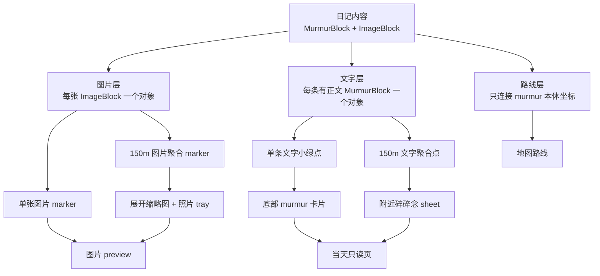

# 照片地图功能总览

这份文档回答“照片地图对用户来说是什么”。它尽量少讲实现细节，更多描述屏幕上的对象、用户能做什么、哪些行为应该互相独立。对象关系见 [照片地图数据模型](照片地图数据模型.md)，实现链路见 [照片地图数据流与渲染](照片地图数据流与渲染.md)，MapLibre 机制见 [MapLibre 技术说明与依赖](<MapLibre 技术说明与依赖.md>)。

一句话：照片地图把日记里的照片和文字按空间关系重新组织，让用户从“我在什么地方拍了什么、写了什么”重新进入某一天。

## 1. 核心原则

- 图片和文字是两条独立地图层：照片按单张图片看，文字按单条碎碎念读。
- 聚合只服务浏览，不改变日记原始内容。
- 图片预览、照片 tray、文字 sheet、底部 murmur 卡片各自有明确入口，不能互相偷改状态。
- 没有可信坐标的内容不强行上地图，`0,0` 视为脏数据。
- 地图上的缩略图来自应用缓存，原图只在大图预览里使用。

## 2. 用户看到什么

| 区域 | 作用 | 主要入口 |
| --- | --- | --- |
| 顶部统计卡 | 展示当前筛选周期内的碎碎念数、照片数和未定位数 | 定位按钮 |
| 地图底图 | 承载路线、图片 marker 和文字 marker | 拖拽、缩放、点击空白 |
| 图片 marker | 每张图片一个地图对象；聚合后显示代表缩略图和 `N张` | 点击单图预览；点击聚合展开 |
| 文字 marker | 每条有正文碎碎念一个地图对象；单条是小绿点，聚合是数字点 | 点击单点选中文字；点击聚合打开附近 sheet |
| 照片 tray | 图片聚合展开后的底部照片列表 | 点击照片进入 gallery preview |
| 附近碎碎念 sheet | 文字聚合展开后的附近内容列表 | 点击条目进入当天只读页 |
| 底部 murmur 卡片 | 当前选中文字的快速阅读和日期入口 | 横滑定位；点卡片打开当天只读页；点图片预览 |
| 图片 preview | 全屏查看原图或一组图片 | 关闭后回到进入预览前的地图现场 |

## 3. 内容分层

这三个层互相关联，但不互相伪装：

- 图片层可以 fallback 使用所属 murmur 坐标，但会记录 `coordinateSource: 'murmur'`。
- 文字层只使用 murmur 自己的坐标。
- 路线层只使用 murmur 自己的坐标，不用图片坐标补线。

## 4. 图片主线

图片主线解决“我在这里拍了哪些照片”。

图片层只回答两个问题：

- 这里有哪些照片。
- 这些照片能不能被快速放大查看。

图片交互不会改变底部文字卡片，也不会把用户带到某条碎碎念。照片就是照片，先让用户看清图片本身。

精确点击、展开、预览关闭和收起规则见 [照片地图交互流转](照片地图交互流转.md)。

## 5. 文字主线

文字主线解决“我在这里写了什么”。

文字层只回答两个问题：

- 这里有哪些文字记录。
- 从这些文字记录如何进入当天只读页。

文字聚合的重点不是立刻选中某一条，而是先把“这附近有多条内容”呈现出来，让用户自己决定读哪一条。

底部 murmur 卡片的心智也保持简单：横滑负责定位，卡片主体负责打开当天，只读列表由 `附近 N 条` 和文字聚合点共同进入。精确规则见 [照片地图交互流转](照片地图交互流转.md)。

## 6. 地图移动规则

地图移动遵循一个原则：只有“帮助用户看清当前空间对象”的动作才移动相机。

- 首次进入、点击聚合点、点击单条文字点、横滑到底部某张文字卡片，会移动地图。
- 看图、打开当天只读页、关闭 preview、点击地图空白，不应该把用户带到另一个位置。
- 从图片组或文字组进入覆盖层后返回，应恢复原地图现场，而不是重新定位到别的点。

## 7. 未定位与脏数据

照片地图不会把不可信坐标放到地图上。

这个原则只影响地图展示，不代表日记内容被删除。未定位内容仍计入顶部统计，让用户知道筛选周期内有多少内容没有坐标。

具体坐标判定、图片 fallback 和路线使用规则见 [照片地图数据流与渲染](照片地图数据流与渲染.md)。

## 8. 缩略图边界

地图、tray、列表小图都应该使用缓存缩略图，避免把原图塞进小 UI。

缩略图只是一层可丢弃缓存，不是日记内容；大图 preview 始终使用原图。缓存位置和生成链路见 [照片地图数据流与渲染](照片地图数据流与渲染.md)。

## 9. 设计边界

当前刻意不做这些事：

- 不把图片 marker 和文字 marker 合并成混合 cluster。
- 不让图片点击改变底部文字卡片。
- 不让文字聚合直接打开某一条内容。
- 不用图片坐标补 murmur 路线。
- 不把当前系统定位写成图片位置。
- 不把缩略图当作日记内容保存。

这些边界能让地图行为更可预期，也方便后续单独演进图片层或文字层。
