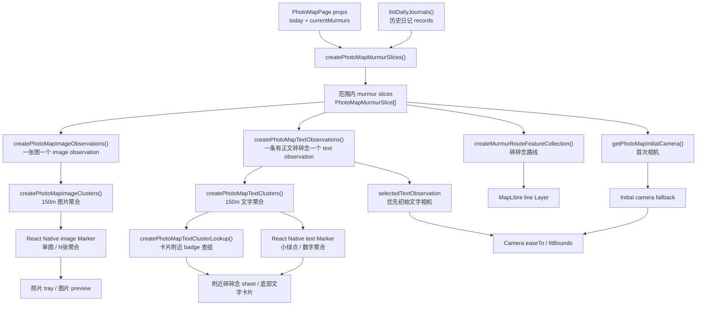
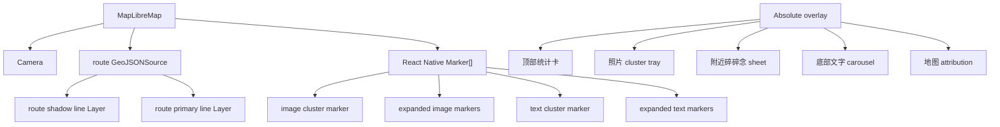

# 照片地图数据流与渲染

这份文档记录移动端照片地图从日记数据到地图渲染的当前实现。代码事实以 `apps/mobile/src/pages/photoMapData.ts`、`apps/mobile/src/pages/photoMapInteraction.ts`、`apps/mobile/src/pages/photoMapViewModel.ts` 和 `apps/mobile/src/pages/PhotoMapPage.tsx` 为准；地图 UI 的目标是让用户在空间上回看文字碎碎念和照片，而不是把图片当作碎碎念的附属代表物。数据对象关系见 [照片地图数据模型](照片地图数据模型.md)，MapLibre 组件和事件机制见 [MapLibre 技术说明与依赖](<MapLibre 技术说明与依赖.md>)。

本文只维护实现层的派生顺序、聚合算法、渲染输入、相机和路线规则。产品心智见 [照片地图功能总览](照片地图功能总览.md)，点击、返回和恢复规则见 [照片地图交互流转](照片地图交互流转.md)。

## 1. 核心文件

| 文件 | 职责 |
| --- | --- |
| `apps/mobile/src/pages/PhotoMapPage.tsx` | 页面状态、日记读取、MapLibre 渲染、图片/文字 marker、照片 tray、文字 sheet 和交互编排 |
| `apps/mobile/src/pages/photoMapData.ts` | 把日记记录转换成内部范围切片、image/text observation、cluster、路线和初始相机 |
| `apps/mobile/src/pages/photoMapInteraction.ts` | 照片地图临时交互状态机，区分普通进入和预览恢复 |
| `apps/mobile/src/pages/photoMapViewModel.ts` | 页面渲染前的纯计算：可见 cluster 截断、文字 cluster lookup、未定位计数和展开 marker 几何 |
| `apps/mobile/src/services/mobileImageThumbnails.ts` | 为地图 marker、照片 tray 和卡片提供缓存缩略图 URI |
| `packages/journal-core/src/imageLocation.ts` | 校验图片和碎碎念位置坐标，过滤越界、非数字和 `0,0` 脏数据 |

照片地图默认展示近 7 天内容，范围可以切换为近 2 周、近 1 月和全部。图片层和文字层都使用固定 `150m` 聚合半径。

## 2. 总数据流



有两个重要边界：

- 当前日优先使用 `currentMurmurs`，不会被磁盘里同一天的旧记录覆盖。
- 缩略图只在应用缓存中生成和读取，不写回 `ImageBlock`、Markdown 或同步仓库。

## 3. 模型派生入口

模型字段和对象关系只维护在 [照片地图数据模型](照片地图数据模型.md)。这里记录这些模型在代码里的生成入口：

| 函数 | 输入 | 输出 | 说明 |
| --- | --- | --- | --- |
| `createPhotoMapMurmurSlices()` | 历史日记、当前日内存数据、range | `PhotoMapMurmurSlice[]` | 合并当前日、按范围过滤、按新到旧排序，作为后续 observation 的临时输入 |
| `createPhotoMapImageObservations()` | `PhotoMapMurmurSlice[]` | `PhotoMapImageObservation[]` | 一张图片生成一个图片 observation |
| `createPhotoMapTextObservations()` | `PhotoMapMurmurSlice[]` | `PhotoMapTextObservation[]` | 有正文且有 murmur 坐标时生成文字 observation |
| `createPhotoMapImageClusters()` | image observations | `PhotoMapImageCluster[]` | 图片层独立聚合 |
| `createPhotoMapTextClusters()` | text observations | `PhotoMapTextCluster[]` | 文字层独立聚合 |

后续渲染、相机和 sheet/tray 都从 observation 与 cluster 推导，不直接把 `MurmurBlock` 或 `ImageBlock` 当作 marker 渲染单位。

## 4. 坐标处理

所有位置都先经过 `hasUsableImageLocationCoordinates()`。当前规则：

- latitude 必须是有限数字，范围 `[-90, 90]`。
- longitude 必须是有限数字，范围 `[-180, 180]`。
- `0,0` 视为脏数据，不进入地图。

不可用位置不会生成 observation，也不会参与 cluster、route 或 camera。图片 fallback 到 murmur 坐标只是为了让照片仍能在地图上被看见；它不会被误认为真实 EXIF 坐标。

## 5. 聚合模型

图片层和文字层分开聚合，不混成一个 cluster。两层都使用固定 `150m` 半径；这个半径暂时不随 zoom 改变。

cluster 字段定义见 [照片地图数据模型](照片地图数据模型.md)，这里只维护聚合算法。

marker 数量超过 `80` 时只显示前 80 个 cluster，但会保留当前 active 或 selected cluster，避免选中态突然消失。

### 聚合算法

聚合不是“只看 cluster 质心”的算法。当前规则是：

1. 按 observation 输入顺序逐个处理，输入顺序来自范围过滤后的新到旧排序，同一个 murmur 内图片保留原始图片顺序。
2. 新 observation 与某个 cluster 内任一 item 距离小于等于 `150m`，就进入这个 cluster。
3. 如果新 observation 同时连接多个已有 cluster，就把这些 cluster 合并。
4. 合并后 `coordinates` 重新计算为组内全部 item 坐标平均值。
5. `representativeItem` 保持该 cluster 首个 item，用于 marker 的代表图或代表文字。

这个设计刻意支持“链式相邻”：A-B 在 150m 内、B-C 在 150m 内，即使 A-C 超过 150m，也会被视为同一片附近内容。这样更符合街区连续记录的浏览直觉，也避免近距离 marker 被拆成互相遮挡的多个点。

## 6. 渲染层级

地图由 MapLibre 和 React Native overlay 共同组成。



MapLibre layer 只负责路线。图片 marker、文字 marker、展开态 marker 使用 React Native `Marker`，方便渲染缩略图、数字 badge 和展开态。

## 7. 渲染状态输入

数据流文档只记录页面渲染需要哪些状态输入，不维护具体点击流转。状态转换、返回恢复和验收清单见 [照片地图交互流转](照片地图交互流转.md)。

| 输入 | 影响的渲染 |
| --- | --- |
| `selectedTextId` | 底部文字 carousel 当前卡片、单条文字 marker 选中态、文字相机定位 |
| `interaction` | 是否展示图片 cluster tray、附近碎碎念 sheet、展开图片 marker、展开文字 marker |
| `range` | observation、cluster、路线、统计卡和未定位计数 |
| image thumbnail cache | 图片 marker、照片 tray、底部卡片小图的 URI |
| MapLibre camera ready state | 首次相机、cluster fit 和文字定位是否可以执行 |

页面渲染只从这些输入推导 UI，不把 cluster、thumbnail 或展开态写回日记数据。

## 8. 相机与路线

页面实际初始相机有两层，且只在地图已加载、有可地图化内容、当前 `interaction` 是 `browse` 时应用：

- 如果当前有 `selectedTextObservation`，页面优先把相机放到这条文字 observation，zoom 为 `12.2`。
- 否则使用 `getPhotoMapInitialCamera(murmurSlices)`。

`getPhotoMapInitialCamera()` 的规则：

- 优先第一条有可用相机坐标的 murmur。
- murmur 没坐标但图片有坐标时，可 fallback 到图片坐标。
- 全部无坐标时使用默认中国视角。

路线仍只连接 `murmur.location`，不会使用图片坐标伪装移动路线。

用户主动触发的相机动作和初始相机分开：

- 点击图片聚合或文字聚合：`fitBounds()` 到 cluster 范围。
- 点击普通文字 marker、横滑底部文字卡片、顶部统计卡定位按钮：`easeTo()` 到对应文字或首个可用内容。
- 点击展开后的文字小绿点：只更新 `selectedTextId` 并保持 sheet / group 上下文，不主动移动相机。
- 从图片组进入 preview 再关闭：必要时用无动画方式恢复到原图片 cluster。

## 9. 测试覆盖

当前相关测试主要在 `apps/mobile/src/pages/photoMapData.test.ts`、`apps/mobile/src/pages/photoMapInteraction.test.ts` 和 `apps/mobile/src/pages/photoMapViewModel.test.ts`：

- 数据入口：默认近 7 天、当前日内存数据覆盖磁盘同日旧记录、范围过滤按日记日期处理。
- observation：一图一个 image observation；有正文且有 murmur 坐标才生成 text observation；纯图片碎碎念不生成 text observation。
- 坐标：图片坐标优先，缺失时 fallback 到 murmur 坐标并记录 `coordinateSource`；`0,0`、越界和非数字不进入 observation、路线和初始相机。
- 聚合：图片和文字都按 `150m` 聚合，覆盖远距离不误聚、链式相邻成组、桥接 observation 合并已有 cluster。
- 路线：只使用 murmur 本体坐标。

建议修改照片地图逻辑后至少运行：

```sh
pnpm --filter @journal/mobile run test -- photoMapData photoMapInteraction photoMapViewModel
pnpm --filter @journal/mobile run typecheck
```

涉及 marker 视觉、相机、照片 tray、文字 sheet 和 preview 行为时，还需要在 iOS 模拟器或 Android 真机做一次 UI 走查。
