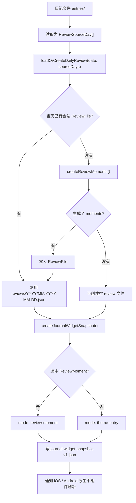
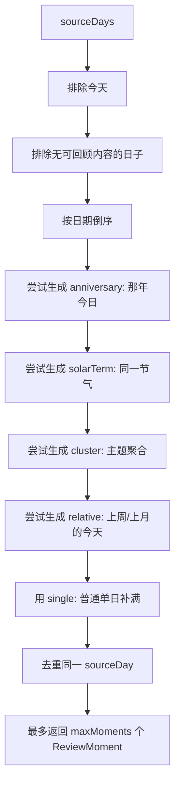
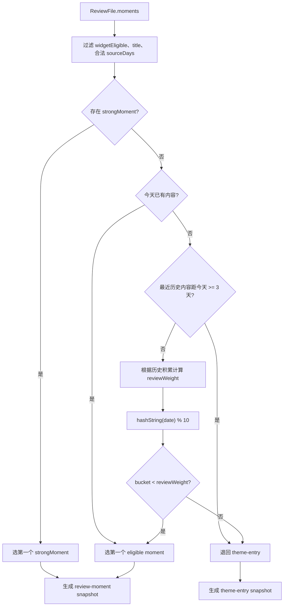
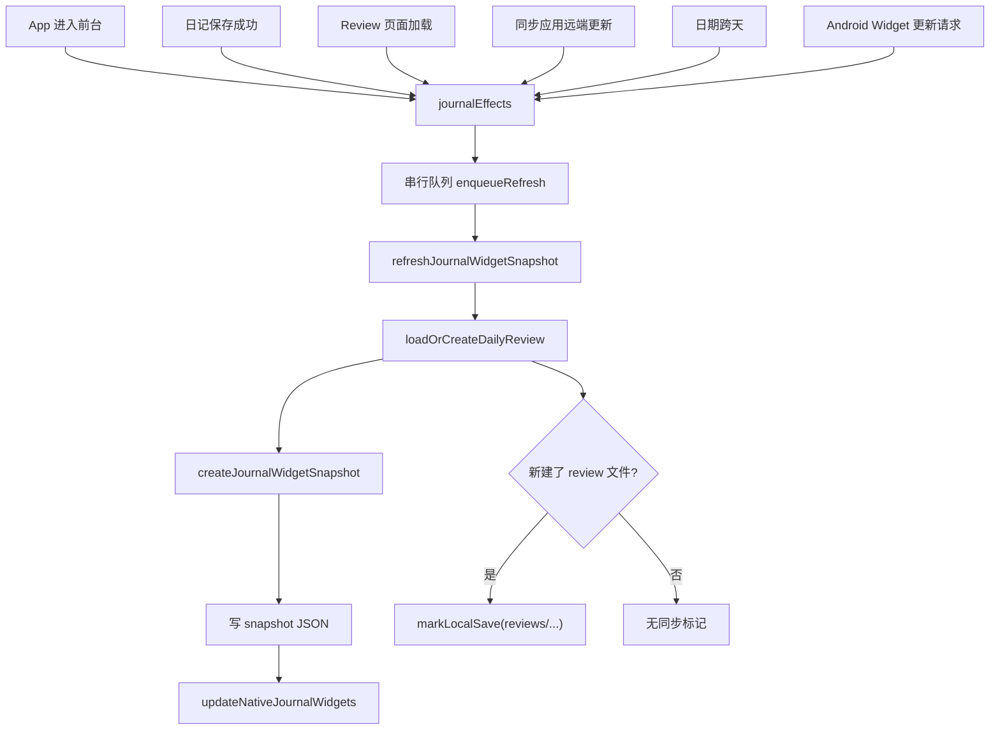

# 回顾与小组件机制说明

这份文档整理 `ReviewMoment`、`ReviewFile`、`JournalWidgetSnapshot`、小组件刷新和移动端副作用协调之间的关系。代码事实以 `packages/journal-core/src/reviewMoments.ts`、`packages/journal-core/src/journalWidgetSnapshot.ts`、移动端 `journalWidgetSnapshotStore.ts` 和 `journalEffects.ts` 为准。

## 结论速览

- 数据从 `ReviewMoment` 进入按天保存的 `ReviewFile`，再投影成小组件读取的 `JournalWidgetSnapshot`。
- 小组件和 Review 页面共用 `loadOrCreateDailyReview()`，由同一份 `ReviewFile` 提供 moments。
- 小组件内容默认按天稳定：同一天、同一批数据会得到同一条 snapshot。
- 移动端用 `journalEffects` 做命名副作用协调和串行刷新，控制刷新和同步副作用的复杂度。

## 核心关系

| 数据 | 角色 |
| --- | --- |
| `ReviewMoment` | 领域语义层，描述“哪一天、因为什么线索值得被重新看见” |
| `ReviewFile` | 按天落盘的 review 容器，路径是 `reviews/YYYY/MM/YYYY-MM-DD.json` |
| `JournalWidgetSnapshot` | 原生小组件读取的轻量展示契约，只保存标题、副标题、脚注、模式和点击动作 |

snapshot 可以来自某个 review moment，也可以退回到“此刻入口”的 theme entry。它不保存完整回顾上下文。

`ReviewMoment` 是候选和解释，`JournalWidgetSnapshot` 是今天真正贴到桌面上的一张小纸条。

## 整体流程图



## ReviewMoment 的生成入口

`createReviewMoments(sourceDays, { today, maxMoments })` 会从历史日记里生成最多 5 个 moment。

生成前先做过滤和排序：

- 排除今天，只看过去的日记。
- 排除没有可回顾内容的日子。
- 按日期倒序排列，越新的历史日记越靠前。

“有可回顾内容”定义为：

- 长日记正文非空；或
- 至少一条 murmur 有文字；或
- 至少一条 murmur 有图片。

注意：长日记正文会让这一天进入候选天列表，但普通单日 moment 的短句提取只看 murmur，不会从长日记正文里摘句。

## Moment 类型和优先级

生成器按固定优先级创建 moment，而不是对所有候选做统一打分。

| 优先级 | moment | 生成条件 | 备注 |
| --- | --- | --- | --- |
| 1 | `anniversary` | 历史里有同月同日的日记 | 多年命中时选最近一年 |
| 2 | `solarTerm` | 今天是节气，历史里有同一节气当天的日记 | `kind` 仍是 `single`，但 id 带 `solar-term`，anchors 带 `solarTerm` |
| 3 | `cluster` | 某个 theme 至少出现在 2 个不同日子 | 优先出现天数最多；同数时选最近出现更近的 theme；`sourceDays` 最多 3 天 |
| 4 | `relative` | 历史里有“上周的今天”或“上个月的今天” | 比普通单日强一点，但不属于小组件强回顾；上个月只匹配真实存在的同号日期 |
| 5 | `single` | 最近历史日记补位 | 必须有短句、图片或 theme 生成 subtitle；只有长日记正文不会生成普通单日 |

同一个 source day 只会出现在一个 moment 中。前面优先级已经使用过的日期，后续规则会跳过。

## Moment 生成流程图



## Day candidate 怎么选

每个单日相关 moment 会先构造一个 `DayCandidate`。它是从某一天里挑出的代表性材料。

规则：

1. 找第一条有合适短句的 murmur。
2. 找第一条有图片的 murmur。
3. 用上面两者之一作为时间锚点来源；如果都没有，则用当天第一条 murmur。

短句从 murmur 正文中提取：

- 按换行、句号、问号、感叹号、分号切句。
- 取第一句满足长度的句子。
- 去空白后长度需要在 6 到 28 个字符之间。
- 排除包含明显负向词的句子，例如“崩溃”“绝望”“痛苦”“想死”等。

这个过滤是为了避免小组件突然把过于尖锐的句子浮到桌面上。

## Title 怎么来

不同 moment 的 title 来源如下：

| moment | title 规则 |
| --- | --- |
| `anniversary` | `createAnchoredTitle("那年今日", sourceDay, candidate)`，例如 `那年今日，小雨`、`那年今日，午后` |
| `solarTerm` | `{节气名}那天`，例如 `芒种那天` |
| `cluster` | `你留下过一些{主题短名}`，主题短名会去掉开头的“此刻的”或“今天” |
| `relative` | `createAnchoredTitle("上周的今天" / "上个月的今天", sourceDay, candidate)` |
| `single` | `createAnchoredTitle(formatDateShort(day.date), day, candidate)`，例如 `6 月 12 日，小雨`、`6 月 12 日，午后` |

`createAnchoredTitle()` 的优先级是：天气、节气、时间锚点、原始 prefix。

## Subtitle 怎么来

subtitle 来自 `DayCandidate`。

优先级是：

1. 有合适短句：`你写过一句：...`
2. 有图片：优先用图片 caption；没有 caption 时用 `你留过一张照片。`
3. 有 theme：内置 theme 使用 `{主题名}里的一小块。`，非内置 theme 直接使用 theme id
4. 都没有：没有 subtitle

普通单日 moment 没有 subtitle 就不会被创建。anniversary、solarTerm 和 relative moment 允许没有 subtitle。

## Anchors 怎么来

`ReviewAnchor` 是 moment 的解释性线索。类型里定义了 7 种：

```ts
'date' | 'solarTerm' | 'weather' | 'timeOfDay' | 'season' | 'personal' | 'theme'
```

生成逻辑会产出：

| anchor | 是否生成 | 来源 |
| --- | --- | --- |
| `date` | 会 | 日记日期 |
| `solarTerm` | 会 | 日期命中节气 |
| `weather` | 会 | `frontMatter.weather.text` |
| `timeOfDay` | 会 | 代表性 murmur 的时间 |
| `theme` | 会 | murmur 上的主题 |
| `season` | 暂不生成 | 类型预留 |
| `personal` | 暂不生成 | 类型预留 |

普通单日、那年今日和相对日期的 context anchors 顺序是：

```txt
weather -> solarTerm -> timeOfDay -> theme -> theme
```

再加上最前面的 `date` anchor。

节气 moment 会显式插入一个 `solarTerm` anchor，然后在 context anchors 里跳过节气，避免重复。

主题聚合 moment 的 anchors 更简单：

```txt
theme -> date -> timeOfDay?
```

## widgetEligible 是什么

`widgetEligible` 表示这个 moment 是否允许进入小组件推荐池。

它不是“能不能出现在 review 页面”的开关，而是“小组件这种被动、外露、空间很小的场景是否适合展示”的开关。

小组件筛选 eligible moment 时会要求：

- `widgetEligible === true`
- `title` 非空
- `sourceDays` 里至少有一个合法日期

生成器设置：

- `anniversary` 固定是 `true`
- `solarTerm` 固定是 `true`
- `cluster` 固定是 `true`
- `relative` 固定是 `true`
- `single` 写成 `Boolean(candidate.sentence || candidate.image || candidate.themes.length > 0)`

按普通单日生成逻辑，`single` 如果没有短句、图片或 theme，会因为没有 subtitle 而直接不创建。因此由 `createReviewMoments()` 正常生成出来的 moment 通常不会是 `widgetEligible: false`。

也就是说，`false` 主要是一个显式边界和扩展位，可用于：

- review 页可以展示，但不适合突然出现在桌面的小组件内容。
- 只依赖长正文、缺少短展示语的弱 moment。
- 用户标记为私密、敏感或不希望外露的 moment。
- 导入旧数据或手工构造 review 文件时保留“不进小组件”的能力。

## 小组件怎么从 moments 里选一个

`createJournalWidgetSnapshot()` 会从 review 文件里的 moments 中挑一个，或者退回到“此刻入口”。

选择顺序：

1. 过滤出 `widgetEligible`、title 和 sourceDays 都满足条件的 eligible moments。
2. 如果存在强回顾，直接选第一个。强回顾包括 `anniversary`，或 anchors 里有 `solarTerm` / `weather`。
3. 如果今天已有长日记、murmur 或图片，选第一个 eligible moment。
4. 如果最近一篇可回顾历史日记距离今天至少 3 天，并且没有强回顾，退回 `theme-entry`。
5. 否则根据历史积累程度计算 `reviewWeight`，再用日期 hash 做稳定概率选择。

| 历史积累 | 回顾权重 |
| --- | --- |
| 日记数量或跨度 >= 365 天 | 7/10 |
| 日记数量或跨度 >= 180 天 | 7/10 |
| 日记数量或跨度 >= 90 天 | 5/10 |
| 更少 | 3/10 |

然后用当天日期算一个稳定 bucket：

```txt
hashString(date) % 10
```

如果 bucket 小于权重，就显示回顾；否则显示此刻入口。

## 小组件选择流程图



## Snapshot 的两种结果

如果选中了 review moment，snapshot 是：

```ts
{
  mode: "review-moment",
  title: moment.title,
  subtitle: moment.subtitle,
  footnote: "...",
  action: { type: "reviewDay", date: sourceDay }
}
```

footnote 会取非 `date` anchors 的前两个 label。

例如 anchors 是：

```txt
date -> weather: 小雨 -> timeOfDay: 午后 -> theme: 散步
```

footnote 会是：

```txt
小雨 · 午后
```

如果没有选中 review moment，snapshot 是：

```ts
{
  mode: "theme-entry",
  title: theme.label,
  subtitle: theme.entrySubtitle,
  footnote: "且留",
  action: { type: "write", themeId: theme.id }
}
```

theme-entry 的主题会优先参考最近日记里用过的内置主题；如果没有，则按日期 hash 从内置主题里稳定选择一个。

## 此刻入口主题怎么选

`theme-entry` 会优先延续用户最近使用过的内置主题。

选择规则：

1. 从 `date <= 今天` 的日记里取 murmur themes。
2. 按日期倒序扫描，最近日记优先。
3. 去重并过滤空值。
4. 找第一个能匹配 `BUILT_IN_THEMES` 的 theme。
5. 如果没有匹配，就用 `BUILT_IN_THEMES[hashString(date) % BUILT_IN_THEMES.length]` 按日期稳定选择。

因此，此刻入口不是完全随机，也不是固定显示第一个主题。同一天会稳定选同一个主题；不同日期可能换。

当前内置主题：

| id | label | entrySubtitle |
| --- | --- | --- |
| `sky-now` | 此刻的天空 | 留一张现在的天 |
| `quick-photo` | 随手拍张照 | 看见了就放进来 |
| `small-thing` | 记一件小事 | 不用很完整 |
| `food-today` | 今天吃什么 | 这一口也算今天 |
| `funny-today` | 今天有什么好笑的 | 笑一下也值得留 |
| `thought-maybe` | 一个想法不一定对 | 先放着，不用判对错 |
| `shower-thought` | 浴室沉思 | 水声里的念头 |
| `breathe-moment` | 生活的透气时刻 | 给今天开个小窗 |
| `light-shadow` | 镜头下的光影 | 留住一小块亮处 |
| `curious-colors` | 我拍到的奇妙色彩 | 颜色也会记得今天 |
| `sunrise-sunset` | 日出日落 | 天色变换的时候 |
| `season-report` | 季节情报站 | 一点季节的消息 |

## 生成和刷新时机

### ReviewMoment / ReviewFile

`ReviewMoment` 不会单独落盘。它们会被包含在当天的 `ReviewFile` 里。

真正创建 review 文件的入口是 `loadOrCreateDailyReview({ date, sourceDays })`：

1. 先尝试读取 `reviews/YYYY/MM/YYYY-MM-DD.json`。
2. 如果已有合法 review 文件，直接复用，不重新生成。
3. 如果没有合法 review 文件，就调用 `createReviewMoments()`。
4. 如果生成出了 moments，就写入 review 文件。
5. 如果没有任何 moment，就不创建空 review 文件。

主要调用方是 Review 页面和 snapshot 刷新链路。App 进入前台、保存日记、跨天、同步拉到远端更新，以及 Android widget 请求更新，都会通过 `journalEffects` 进入 snapshot 刷新链路。

如果 review 文件是新创建的，移动端会把对应 `reviews/...json` 作为本地变更交给同步链路。

### JournalWidgetSnapshot

移动端刷新小组件时调用 `refreshJournalWidgetSnapshot()`：

1. 读取本地所有日记，并合并正在编辑的今日内容。
2. 调用 `loadOrCreateDailyReview()`，创建或复用当天 review 文件。
3. 用 review 文件里的 moments 生成 widget snapshot。
4. 写入 `journal-widget-snapshot-v1.json`。
5. 通知原生小组件刷新。

`journal-widget-snapshot-v1.json` 不是同步仓库的一部分，而是移动端本地给原生小组件读取的缓存。

snapshot 的结果可能是：

- `review-moment`：展示旧日浮现。
- `theme-entry`：展示此刻入口。

## 小组件刷新触发点

移动端通过 `journalEffects` 的命名方法协调副作用，不使用开放式事件总线：

| 触发点 | 方法 | 主要作用 |
| --- | --- | --- |
| App 进入前台 | `refreshForAppActive` | 刷新 snapshot，顺便创建或复用当天 review |
| 日记保存成功 | `afterJournalSaved` | 标记本地保存需要同步，并刷新 snapshot |
| Review 页面加载完成 | `afterReviewLoaded` | 标记新建 review 需要同步，并刷新 snapshot |
| 同步应用了远端更新 | `afterRemoteUpdatesApplied` | 刷新 snapshot，反映远端内容变化 |
| 日期跨天 | `afterDateRollover` | 刷新新日期的 snapshot |
| Android 小组件请求更新 | `refreshForWidgetUpdate` | 系统小组件更新时主动刷新 snapshot |

`journalEffects` 内部有一个串行队列。这样连续保存、进入前台、widget 更新等多个刷新不会并发互相踩。

如果事件数量明显增加，再抽象成 typed event dispatcher 会更自然。

## 刷新触发流程图



## 同一天是否固定一条

同一天的小组件内容在数据不变时会固定。

原因是 review 文件按天复用，snapshot 选择使用 `hashString(date) % 10`，不是运行时随机。所以在数据不变的情况下，今天刷新多次，小组件会显示同一条内容或同一种模式。

会让同一天内容变化的情况主要有：

- 今天之前没有 review 文件，第一次刷新创建了它。
- review 文件损坏或 normalize 后为空，需要重新生成。
- 今天从“无内容”变成“已有内容”，小组件可能从“此刻入口”切到“旧日浮现”。
- 同步拉到了远端历史内容，并且当天 review 文件还没创建，可能影响首次生成。
- 如果加入“换一条”“一天内轮换”“用户不喜欢这条”等能力，这个固定性会被有意打破。

产品取向是安静和稳定：桌面上像一张当天固定的小纸条，而不是每次刷新都洗牌。

## 设计边界

推荐逻辑刻意保持保守：

- moment 生成是固定优先级，不是复杂模型。
- 小组件一次只展示一个 snapshot，不展示完整 moment 列表。
- 小组件的随机感来自日期 hash，不来自运行时随机。
- `widgetEligible` 很少产生 false，但保留了区分 review 展示和 widget 外露展示的能力。
- 长日记正文不会被摘句作为普通单日 subtitle。
- `relative` 相对日期比普通单日优先，但不属于小组件强回顾。
- 副作用协调集中在 `journalEffects`，并保持显式方法，避免为少量事件引入过重的事件系统。

如果推荐逻辑变复杂，优先考虑把“为什么选中某个 moment”的原因显式化，例如返回 `selectionReason`，方便调试、测试和产品调整。
